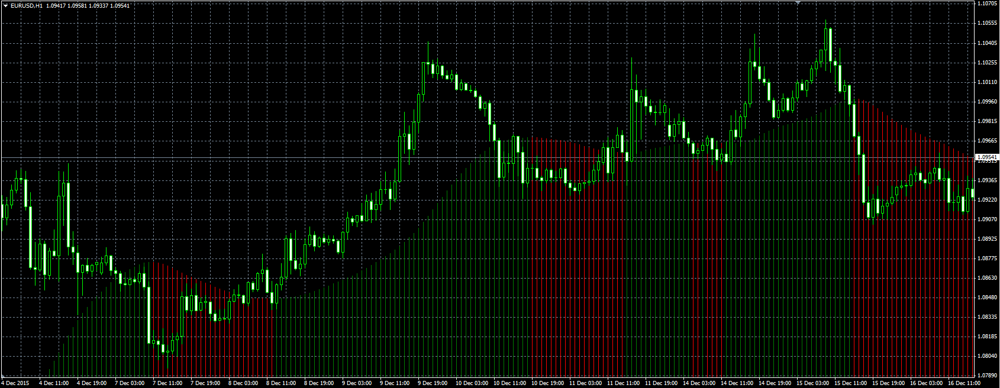

# Trend lord indicator

> Source: https://fxcodebase.com/code/viewtopic.php?f=38&t=62982  
> Forum: 38 · Topic 62982 · 7 post(s)

---

## Trend lord indicator

**Alexander.Gettinger** · Thu Dec 24, 2015 10:22 am

Download:

 [Trend_Lord.mq4](files/103997/Trend_Lord.mq4)

 [Trend_Lord.mq5](files/103997/Trend_Lord.mq5)

TS2 version.
[https://fxcodebase.com/code/viewtopic.php?f=17&t=73462](https://fxcodebase.com/code/viewtopic.php?f=17&t=73462)

---

## Re: Trend lord indicator

**Bigdawg_trader** · Sat Aug 01, 2020 3:55 am

Do we have this in mt5 version... feeling inspired

---

## Re: Trend lord indicator

**Apprentice** · Sun Aug 02, 2020 8:33 am

Your request is added to the development list.
Development reference 1813.

---

## Re: Trend lord indicator

**Apprentice** · Tue Aug 04, 2020 4:52 am

Trend_Lord.mq5 added.

---

## Re: Trend lord indicator

**xristos1982** · Thu Mar 02, 2023 5:08 pm

Can i have this in lua,please?

---

## Re: Trend lord indicator

**Apprentice** · Sun Mar 05, 2023 6:59 pm

We have added your request to the development list.
Development reference 219.

---

## Re: Trend lord indicator

**Apprentice** · Mon Mar 06, 2023 9:41 am

Try this version.
[https://fxcodebase.com/code/viewtopic.php?f=17&t=73462](https://fxcodebase.com/code/viewtopic.php?f=17&t=73462)
