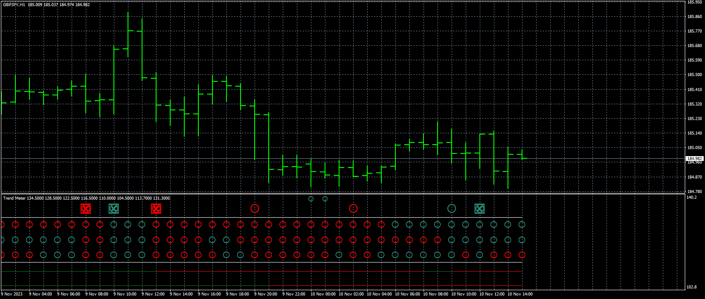
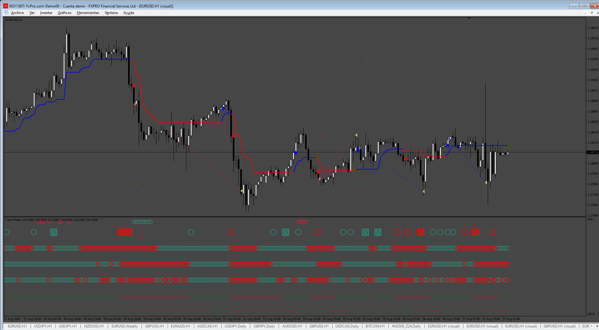
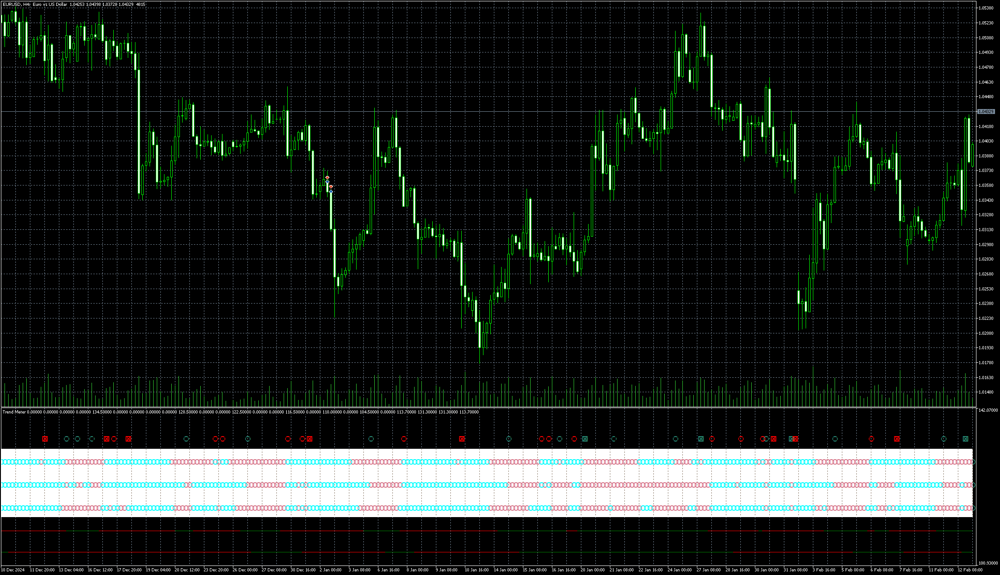

# Trend_Meter

> Source: https://fxcodebase.com/code/viewtopic.php?f=38&t=75175  
> Forum: 38 · Topic 75175 · 12 post(s)

---

## Trend_Meter

**Apprentice** · Sun Sep 01, 2024 4:04 pm

Based on the request.
[https://fxcodebase.com/code/viewtopic.p ... 24#p147824](https://fxcodebase.com/code/viewtopic.php?f=27&p=147824#p147824)

 [Trend_Meter.mq4](files/156560/Trend_Meter.mq4)

---

## Re: Trend_Meter

**Mijail Vargas** · Wed Dec 11, 2024 1:40 am

Hello Apprentice:
You can integrate Trend Meter to Supertrend,
request:
Integrate the Supertrend with the Trend Meter to confirm the Supertrend input signals.

Confirming Entries: The idea is to use the Supertrend as the primary indicator to identify buy and sell signals, and then use the Trend Meter to validate those signals.

The Supertrend will provide buy signals (when the price crosses the Supertrend line upwards) and sell signals (when the price crosses the Supertrend line downwards).
The Trend Meter will help confirm if the trend is strong, if the Trend Meter shows that the trend is strong, the Supertrend signal is considered more reliable, for us to consider it to be strong all indicators must be red to sell and all greens for buy.
The trade must close when a new trade is started.
Thank you very much in advance for your attention.

---

## Re: Trend_Meter

**Apprentice** · Fri Dec 13, 2024 4:20 pm

We have added your request to the development list.
Development reference 915

---

## Re: Trend_Meter

**Apprentice** · Sat Dec 21, 2024 11:49 am

 [SupperAndMeterEA.mq4](files/157590/SupperAndMeterEA.mq4)

---

## Re: Trend_Meter

**teleporter** · Sun Jan 12, 2025 12:09 pm

> **Apprentice wrote:**
>
>
> gbpjpy-h1-fxcm-australia-pty.png
>
>
> Based on the request.
> [https://fxcodebase.com/code/viewtopic.p ... 24#p147824](https://fxcodebase.com/code/viewtopic.php?f=27&p=147824#p147824)
>
>
> Trend_Meter.mq4

Hello Apprentice,

Can you please convert it to mq5?
I've been trying, but no luck, I'm still finding many compilation errors; could you please kindly help?
Thank you in advance.

---

## Re: Trend_Meter

**Apprentice** · Sun Jan 12, 2025 12:36 pm

We have added your request to the development list.
Development reference 20

---

## Re: Trend_Meter

**teleporter** · Mon Jan 13, 2025 11:51 am

> **Apprentice wrote:**
> We have added your request to the development list.
> Development reference 20

Thank you very much. I look forward to the good news.

---

## Re: Trend_Meter

**Apprentice** · Thu Feb 13, 2025 2:24 pm

 [Trend_Meter.mq5](files/158237/Trend_Meter.mq5)

---

## Re: Trend_Meter

**teleporter** · Thu Feb 13, 2025 4:03 pm

> **Apprentice wrote:**
>
>
> eurusd-h4-metaquotes-ltd.png
>
>
>
>
> Trend_Meter.mq5

Thank you very much. That's a marvellous work!

---

## Re: Trend_Meter

**teleporter** · Mon Mar 17, 2025 5:52 pm

Hello,

It seems the number of buffers from MT4 and MT5 versions are not the same.
Can you please help fix. I prefer MT5 version to be exactly the same as MT4.
Thank you very much in advance.

---

## Re: Trend_Meter

**Apprentice** · Fri Mar 21, 2025 6:14 am

We have added your request to the development list.
Development reference 221

---

## Re: Trend_Meter

**Apprentice** · Sun Mar 23, 2025 11:02 am

MT4 and MT5 requires different number of buffers for work
