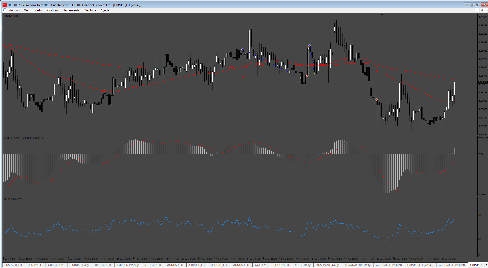
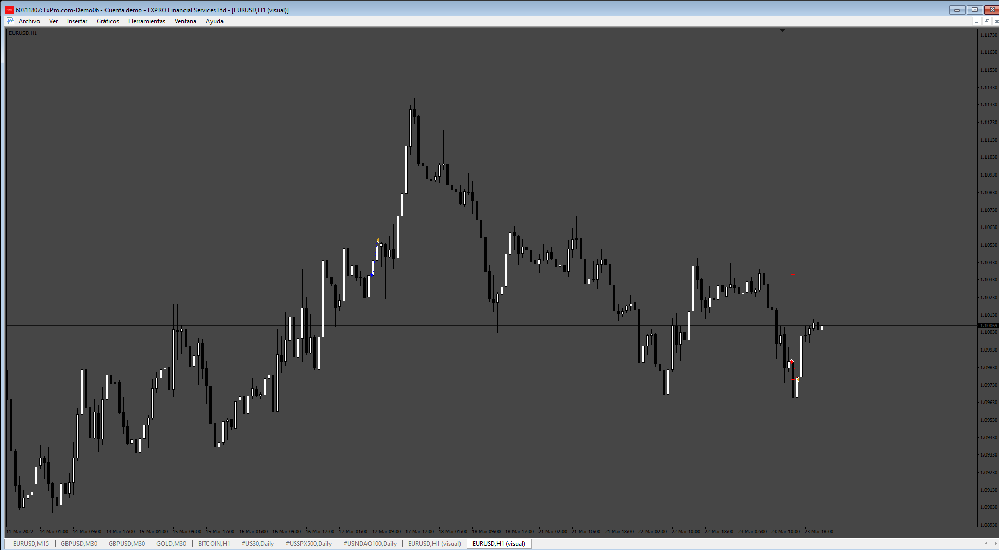

# Trend-Momentum-Volatility-ea

> Source: https://fxcodebase.com/code/viewtopic.php?f=38&t=75625  
> Forum: 38 · Topic 75625 · 6 post(s)

---

## Trend-Momentum-Volatility-ea

**Apprentice** · Wed Feb 19, 2025 4:06 am

Based on the request.
[https://fxcodebase.com/code/viewtopic.php?f=38&t=75598](https://fxcodebase.com/code/viewtopic.php?f=38&t=75598)

 [Trend-Momentum-Volatility-ea.mq5](files/158297/Trend-Momentum-Volatility-ea.mq5)

---

## Re: Trend-Momentum-Volatility-ea

**Mr Nobody** · Wed Feb 19, 2025 10:12 pm

Hi There sorry could you do create for MT4 as well. Thanks!

---

## Re: Trend-Momentum-Volatility-ea

**Apprentice** · Mon Feb 24, 2025 5:45 am

 [Trend-Momentum-Volatility-ea.mq4](files/158377/Trend-Momentum-Volatility-ea.mq4)

---

## Re: Trend-Momentum-Volatility-ea

**Steve Hoang** · Wed Mar 19, 2025 12:24 am

Hi ApprenticeCan you please add more option
- Trailling by R:R
- Breakevent by R:R

Thanks

---

## Re: Trend-Momentum-Volatility-ea

**Apprentice** · Fri Mar 21, 2025 6:12 am

We have added your request to the development list.
Development reference 219

---

## Re: Trend-Momentum-Volatility-ea

**Apprentice** · Sat Apr 26, 2025 3:02 pm

 [Trend-Momentum-Volatility-ea.mq4](files/159049/Trend-Momentum-Volatility-ea.mq4)
