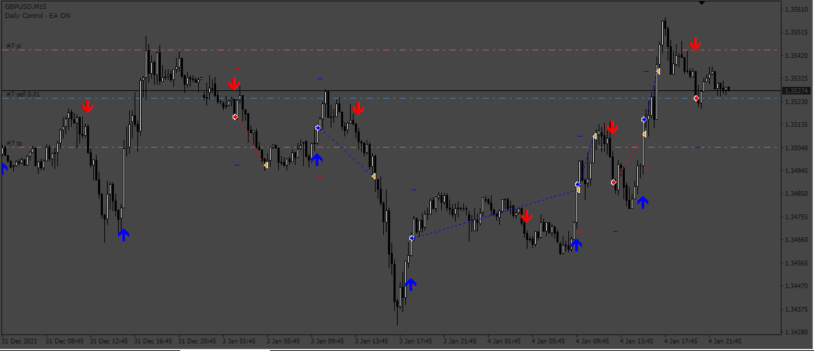
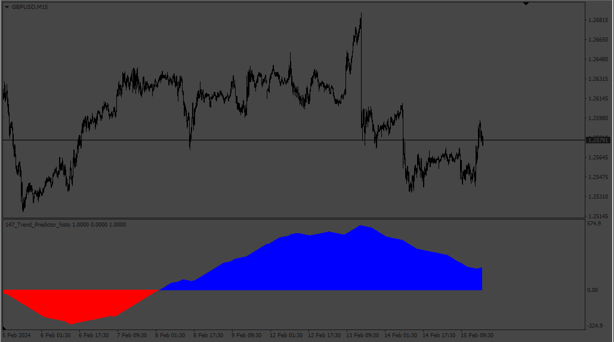
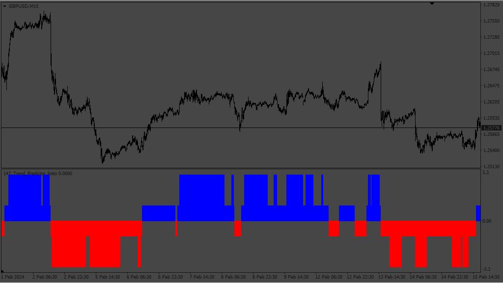
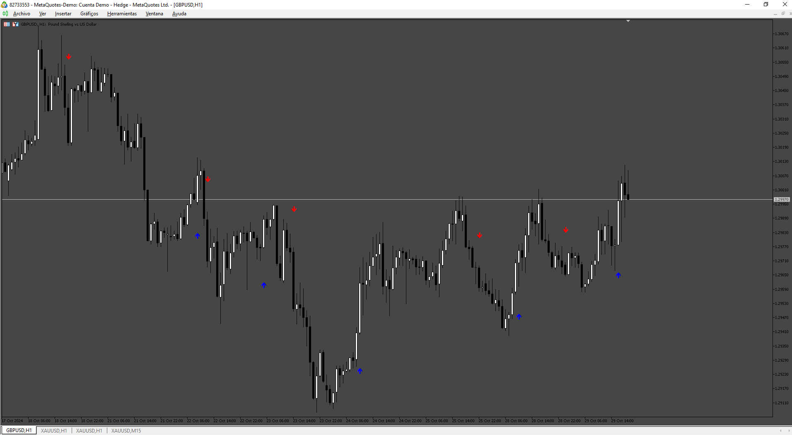

# Trend_Predictor_EA

> Source: https://fxcodebase.com/code/viewtopic.php?f=38&t=74280  
> Forum: 38 · Topic 74280 · 9 post(s)

---

## Trend_Predictor_EA

**Apprentice** · Tue Oct 24, 2023 4:06 am

Based on the request.
[https://fxcodebase.com/code/viewtopic.php?f=38&t=74239](https://fxcodebase.com/code/viewtopic.php?f=38&t=74239)

 [TrendPredictor_v1.0.mq4](files/153039/TrendPredictor_v1.0.mq4)

 [Trend_Predictor_EA.mq4](files/153039/Trend_Predictor_EA.mq4)

---

## Re: Trend_Predictor_EA

**fxlion** · Sun Feb 11, 2024 7:56 am

hi apprendice,

can u create a mtf histogram indicator based on this indicator,

name of indicator: MTF TREND HISTOGRAM
parameters: default parameters ,
time frames: m15,h1,h4

for each time frame:
if current candle is above buy arrow=== histogram contribute is 1
if current candle is below sell arrow === histogram contribute is -1

histogram value is sum of histogram contribute of m15,h1,h4

if histogram is > 0 ====== color of histogram is green
if histogram is < 0 ===== color is histogram is red

thank you.

---

## Re: Trend_Predictor_EA

**Apprentice** · Tue Feb 13, 2024 7:44 am

We have added your request to the development list.
Development reference 147

---

## Re: Trend_Predictor_EA

**Apprentice** · Sat Feb 17, 2024 9:44 am

 

 [Trend_Predictor_histo.mq4](files/154410/Trend_Predictor_histo.mq4)

 [TrendPredictor_v1.0.mq4](files/154410/TrendPredictor_v1.0.mq4)

---

## Re: Trend_Predictor_EA

**kenny22** · Sat Feb 17, 2024 10:31 am

Indicator name
84 string file_custom_indicator = "TrendPredictor_v1.0";

---

## Re: Trend_Predictor_EA

**fiox89** · Sun Feb 18, 2024 5:00 pm

Trend_Predictor_histo, line 163, I think should be

Code: [Select all](https://fxcodebase.com/code/)
`if(i_tf3 >0){`

thanks for the indi

---

## Re: Trend_Predictor_EA

**phnthnhnm** · Sat Oct 12, 2024 5:31 am

Hi expert,
Does this indi repaint? May I ask MQL5 of this indi.
Thank you.

---

## Re: Trend_Predictor_EA

**Apprentice** · Thu Oct 17, 2024 5:20 pm

We have added your request to the development list.
Development reference 797

---

## Re: Trend_Predictor_EA

**Apprentice** · Mon Nov 04, 2024 5:06 am

 [Trend_Predictor.mq5](files/157173/Trend_Predictor.mq5)
