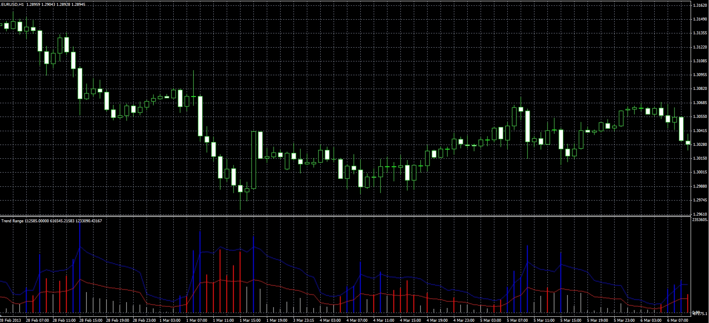

# Trend Range oscillator

> Source: https://fxcodebase.com/code/viewtopic.php?f=38&t=34362  
> Forum: 38 · Topic 34362 · 1 post(s)

---

## Trend Range oscillator

**Alexander.Gettinger** · Wed Apr 10, 2013 4:12 pm

Original indicator: [viewtopic.php?f=17&t=34061](https://fxcodebase.com/code/viewtopic.php?f=17&t=34061)

 

Download:

 [Trend_Range.mq4](files/58599/Trend_Range.mq4)
