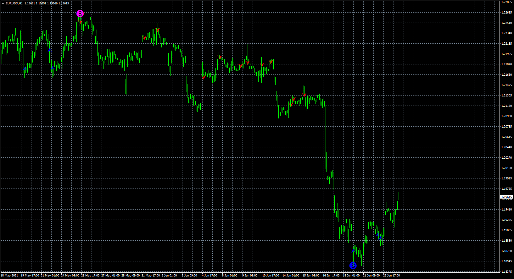
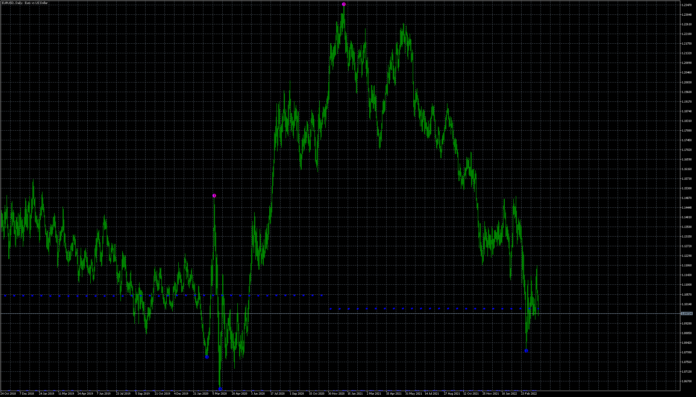
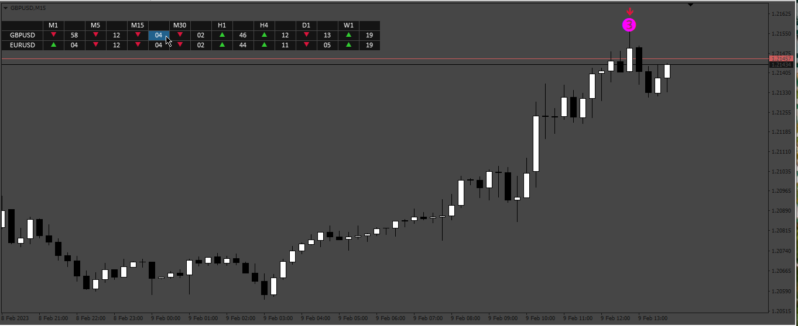

# Trend_Reversal+BB_indicator

> Source: https://fxcodebase.com/code/viewtopic.php?f=38&t=71290  
> Forum: 38 · Topic 71290 · 23 post(s)

---

## Trend_Reversal+BB_indicator

**Apprentice** · Wed Jun 23, 2021 9:32 am

Based on the request.
[https://fxcodebase.com/code/viewtopic.php?f=27&t=71280](https://fxcodebase.com/code/viewtopic.php?f=27&t=71280)

 [TREND-REVERS.mq4](files/142585/TREND-REVERS.mq4)

 [Trend_Reversal+BB_indicator.mq4](files/142585/Trend_ReversalBB_indicator.mq4)

 

 [TREND-REVERS.mq5](files/142585/TREND-REVERS.mq5)

---

## Re: Trend_Reversal+BB_indicator

**tsholo13** · Wed Jun 23, 2021 3:31 pm

Thank you very much sir
Can you please make this scanner
Also if you can turn this to MT5 I will appreciate it..though I dont have TREND-REVERS MT5 version also turn it to scanner if possible
Thank you again

---

## Re: Trend_Reversal+BB_indicator

**tsholo13** · Fri Jun 25, 2021 1:13 am

Thank you sir very much
Can you please make me scanner sir for this and if its possible for you please also convert to MT5 though I dont have TREND-REVERS mq5
Thank you again

---

## Re: Trend_Reversal+BB_indicator

**Apprentice** · Fri Jun 25, 2021 4:57 am

Your request is added to the development list.
Development reference 595.

---

## Re: Trend_Reversal+BB_indicator

**MwlRCT** · Fri Jul 09, 2021 2:38 am

> **Apprentice wrote:**
>
>
> eurusd-h1-forex-capital-markets-4.png
>
>
> Based on the request.
> [https://fxcodebase.com/code/viewtopic.php?f=27&t=71280](https://fxcodebase.com/code/viewtopic.php?f=27&t=71280)
>
>
> TREND-REVERS.mq4
>
>
>
>
> Trend_Reversal+BB_indicator.mq4

Dear Apprentice

Could you please add, this line, to limit number of bars to 500

Code: [Select all](https://fxcodebase.com/code/)
`extern int    BarsLimit = 500;`
Thank you.

---

## Re: Trend_Reversal+BB_indicator

**Apprentice** · Fri Jul 09, 2021 7:41 am

Your request is added to the development list.
Development reference 627.

---

## Re: Trend_Reversal+BB_indicator

**Apprentice** · Mon Jul 12, 2021 1:02 pm

[Trend_Reversal+BB_indicator.mq4](files/142791/Trend_ReversalBB_indicator.mq4)

Try this version.

---

## Re: Trend_Reversal+BB_indicator

**tsholo13** · Mon Jul 12, 2021 2:40 pm

I asked for scanner sir

---

## Re: Trend_Reversal+BB_indicator

**Apprentice** · Tue Jul 13, 2021 9:36 am

Your request is added to the development list.
Development reference 643.

---

## Re: Trend_Reversal+BB_indicator

**ras_michael** · Sun Jul 18, 2021 11:01 am

Hey Mario,

Can i also request a scanner dashboard for this indicator. i would greatly appreciate it.

thanks.

RAS

---

## Re: Trend_Reversal+BB_indicator

**ras_michael** · Wed Jul 21, 2021 4:05 am

Hey Apprentice,

Thanks a million for this download. I really appreciate it.

RAS

---

## Re: Trend_Reversal+BB_indicator

**tsholo13** · Fri Jul 23, 2021 2:21 am

Hey Admin
Thank you very much
But it freezes MT4 especially when adding other symbols,is there anything that can be done to fix that?

---

## Re: Trend_Reversal+BB_indicator

**Apprentice** · Fri Jul 23, 2021 7:55 am

Your request is added to the development list.
Development reference 678.

---

## Re: Trend_Reversal+BB_indicator

**Apprentice** · Tue Jul 27, 2021 3:13 am

[Trend_Reversal+BB_indicator.mq4](files/142976/Trend_ReversalBB_indicator.mq4)

I did some optimizations

---

## Re: Trend_Reversal+BB_indicator

**tsholo13** · Tue Jul 27, 2021 8:29 am

> **Apprentice wrote:**
>
>
> Trend_Reversal+BB_indicator.mq4
>
>
> I did some optimizations

Ok Thank you Apprentice will try this version

---

## Re: Trend_Reversal+BB_indicator

**Apprentice** · Mon Apr 04, 2022 2:10 pm

MT5 version added.

---

## Re: Trend_Reversal+BB_indicator

**tsholo13** · Mon Oct 17, 2022 3:27 pm

Hi Apprentice
Can you please upload "Trend_Reversal+BB_indicator" mq4 scanner again
I do not find it anywhere in the thread when trying to download

---

## Re: Trend_Reversal+BB_indicator

**Apprentice** · Tue Oct 18, 2022 1:53 am

Try this link
[https://fxcodebase.com/code/viewtopic.php?f=38&t=71290](https://fxcodebase.com/code/viewtopic.php?f=38&t=71290)

---

## Re: Trend_Reversal+BB_indicator

**tsholo13** · Tue Oct 18, 2022 3:22 am

The scanner sir
Thats what im looking for

---

## Re: Trend_Reversal+BB_indicator

**Sufiki** · Thu Feb 02, 2023 11:36 am

> **Apprentice wrote:**
>
>
> Trend_Reversal+BB_indicator.mq4
>
>
> I did some optimizations

I still got freeze in MT4. Please also fix and make scanner for MT4

---

## Re: Trend_Reversal+BB_indicator

**Apprentice** · Sun Feb 05, 2023 4:32 am

We have added your request to the development list.
Development reference 127.

---

## Re: Trend_Reversal+BB_indicator

**Apprentice** · Fri Feb 10, 2023 8:14 am

 [TREND-REVERS.mq4](files/149585/TREND-REVERS.mq4)

 [Dashboard_Trend_Reversal.ex4](files/149585/Dashboard_Trend_Reversal.ex4)

---

## Re: Trend_Reversal+BB_indicator

**Apprentice** · Mon Jan 20, 2025 9:51 am

Fixed freeze.

 [Trend_Reversal + BBB_indicator.ex4](files/157898/Trend_Reversal%20BBB_indicator.ex4)
