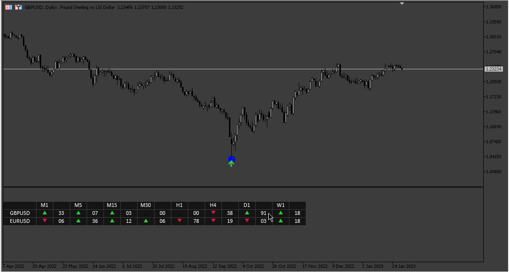
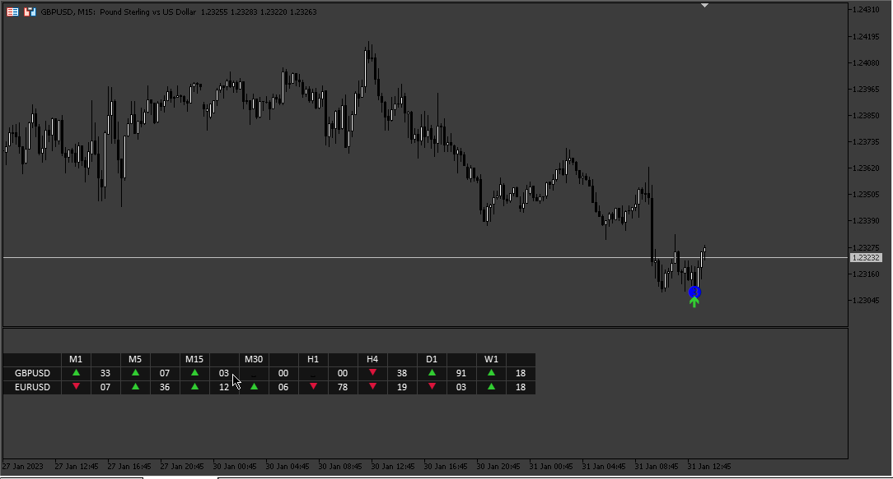
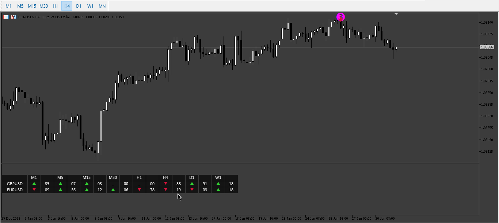
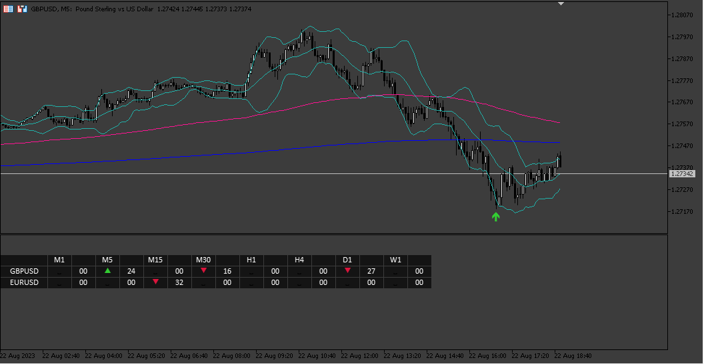

# Trend_Reverse_Dashboard

> Source: https://fxcodebase.com/code/viewtopic.php?f=38&t=73315  
> Forum: 38 · Topic 73315 · 7 post(s)

---

## Trend_Reverse_Dashboard

**Apprentice** · Wed Feb 01, 2023 11:32 am

 

 

Based on the request.
[https://fxcodebase.com/code/viewtopic.php?f=27&p=148979](https://fxcodebase.com/code/viewtopic.php?f=27&p=148979)

 [Trend_Reverse_Dashboard.mq5](files/149435/Trend_Reverse_Dashboard.mq5)

TREND-REVERS.mq4
[https://fxcodebase.com/code/viewtopic.php?f=38&t=71290](https://fxcodebase.com/code/viewtopic.php?f=38&t=71290)

---

## Re: Trend_Reverse_Dashboard

**Sufiki** · Thu Feb 02, 2023 11:10 am

please make for mt4

---

## Re: Trend_Reverse_Dashboard

**Apprentice** · Sun Feb 05, 2023 4:33 am

We have added your request to the development list.
Development reference 128.

---

## Re: Trend_Reverse_Dashboard

**tsholo13** · Sun Aug 06, 2023 3:31 am

Thank you sir for dashboard
I need some extra filters:
200ema, 800ema and Bollinger Bands (50 period, 20)

Buy alert:
if 200 ema crossed above 800 ema..Low<BB(50,20)..TREND-REVERS Buy arrow appears

Sell alert:
if 200 ema crossed below 800 ema..High>BB(50,20)..TREND-REVERS Sell arrow appears

---

## Re: Trend_Reverse_Dashboard

**Apprentice** · Tue Aug 08, 2023 3:15 am

We have added your request to the development list.
Development reference 676.

---

## Re: Trend_Reverse_Dashboard

**Apprentice** · Fri Aug 25, 2023 2:47 am

 [Trend_Reverse_Dashboard_v2.mq5](files/152244/Trend_Reverse_Dashboard_v2.mq5)

---

## Re: Trend_Reverse_Dashboard

**Apprentice** · Fri Jul 25, 2025 4:23 am

[Trend_Reverse_Dashboard_v2.mq4](files/160023/Trend_Reverse_Dashboard_v2.mq4)
