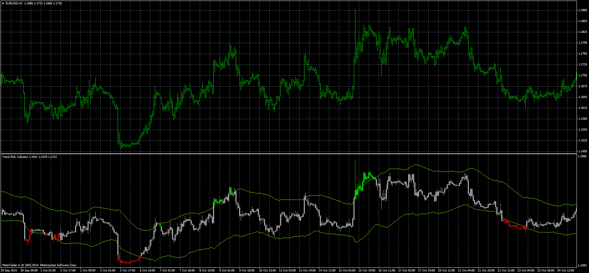
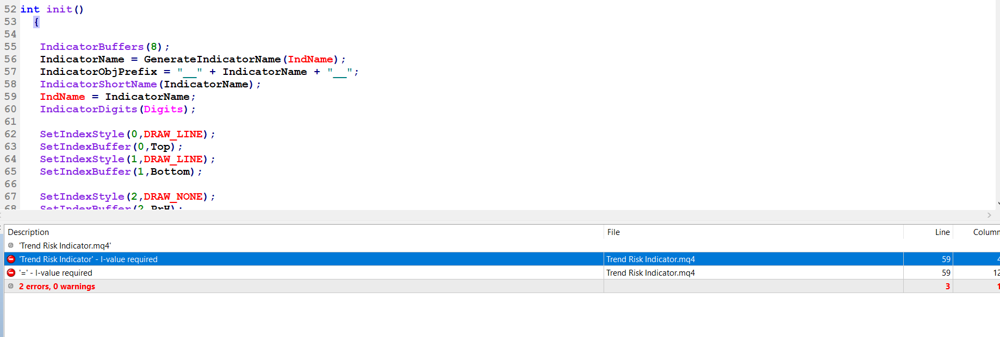

# Trend Risk Indicator

> Source: https://fxcodebase.com/code/viewtopic.php?f=38&t=61722  
> Forum: 38 · Topic 61722 · 14 post(s)

---

## Trend Risk Indicator

**Apprentice** · Thu Jan 15, 2015 6:40 am

Based on lua templates.
[viewtopic.php?f=17&t=61007&p=95243#p95243](https://fxcodebase.com/code/viewtopic.php?f=17&t=61007&p=95243#p95243)

 [Trend Risk Indicator.mq4](files/98168/Trend%20Risk%20Indicator.mq4)

---

## Re: Trend Risk Indicator

**Dax888** · Thu Jan 15, 2015 1:03 pm

Thank you very much!

Would it be possible to have it integrated inside the main chart panel like a band. This indicator gives a very accurate up or down limit when used over 14 periods.

Please drop me a bitcoin address and I'll tip you for your great help.

---

## Re: Trend Risk Indicator

**Apprentice** · Thu Jan 15, 2015 6:44 pm

Please use official paypall donation channel.
[https://www.paypal.com/us/cgi-bin/websc ... 7a6cbd8fb4](https://www.paypal.com/us/cgi-bin/webscr?cmd=_flow&SESSION=oCvrODKgHZZ9Elrd_XgShMa5qb_7qBLE4B7bY8M7Z0nyVOBms-8jjUXW47K&dispatch=5885d80a13c0db1f8e263663d3faee8d66f31424b43e9a70645c907a6cbd8fb4)

---

## Re: Trend Risk Indicator

**toptrader2020** · Sun Apr 05, 2020 5:28 pm

> **Apprentice wrote:**
>
>
> The attachment **error.PNG** is no longer available
>
>
> Based on lua templates.
> [viewtopic.php?f=17&t=61007&p=95243#p95243](https://fxcodebase.com/code/viewtopic.php?f=17&t=61007&p=95243#p95243)
>
>
> The attachment **error.PNG** is no longer available

Hello Apprentice,

Thank you for the indicator.

When I am trying to compile the mq4 file, it throws below errors.

---

## Re: Trend Risk Indicator

**Apprentice** · Mon Apr 06, 2020 4:56 am

Your request is added to the development list.
Development reference 1013.

---

## Re: Trend Risk Indicator

**toptrader2020** · Tue Apr 07, 2020 2:50 am

> **Apprentice wrote:**
> Your request is added to the development list.
> Development reference 1013.

Thank you.

---

## Re: Trend Risk Indicator

**Apprentice** · Tue Apr 07, 2020 5:19 am

Try it now.

---

## Re: Trend Risk Indicator

**toptrader2020** · Tue Apr 07, 2020 2:10 pm

> **Apprentice wrote:**
> Try it now.

Did you upload the latest file?

---

## Re: Trend Risk Indicator

**toptrader2020** · Tue Apr 07, 2020 2:31 pm

> **Apprentice wrote:**
> Try it now.

Works like a charm. Thanks alot

---

## Re: Trend Risk Indicator

**toptrader2020** · Tue Apr 07, 2020 2:50 pm

> **Apprentice wrote:**
>
>
> The attachment **EURUSDH1.png** is no longer available
>
>
> Based on lua templates.
> [viewtopic.php?f=17&t=61007&p=95243#p95243](https://fxcodebase.com/code/viewtopic.php?f=17&t=61007&p=95243#p95243)
>
>
> The attachment **EURUSDH1.png** is no longer available

It is now working but not showing how it use to show in the this image.

---

## Re: Trend Risk Indicator

**forexced** · Tue Apr 07, 2020 6:40 pm

Please is the automated or for manual trading?
If not automated, can you build a profitable automated EA?

Thanks

---

## Re: Trend Risk Indicator

**forexced** · Tue Apr 07, 2020 6:49 pm

The indocator only shows the band but no candle in it

---

## Re: Trend Risk Indicator

**Apprentice** · Thu Apr 09, 2020 5:13 am

> **forexced wrote:**
> Please is the automated or for manual trading?
> If not automated, can you build a profitable automated EA?
>
> Thanks

Can you provide Trade rules for Buy/Sell/Close?
Not sure we can guarantee profitable automated EA.

---

## Re: Trend Risk Indicator

**AfsalMe** · Thu Apr 09, 2020 6:14 am

Attached screenshot with file seems good. Will check in terminal.

Tested the indicator, but not working. Only bands are visible. Candles are not visible inside band
