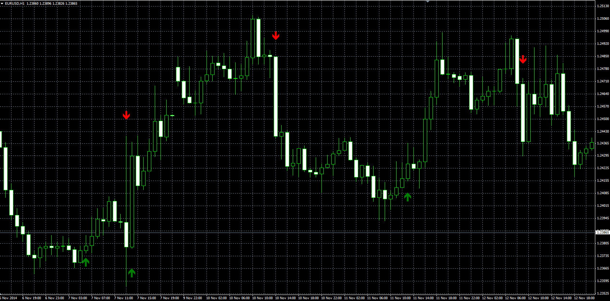

# Trend Signal Indicator

> Source: https://fxcodebase.com/code/viewtopic.php?f=38&t=61514  
> Forum: 38 · Topic 61514 · 4 post(s)

---

## Trend Signal Indicator

**Alexander.Gettinger** · Fri Nov 21, 2014 4:53 pm

Original LUA indicator: [viewtopic.php?f=17&t=3918](https://fxcodebase.com/code/viewtopic.php?f=17&t=3918).

> This indicator gives an indication of trend reversal,
> when the closing price rises / falls above / below the maximum / minimum for a defined period.
>
> With Risk parameter we can determine the distance from the extreme price for that period.
> We define it as a percentage of the range for that period.

 

Download:

 [Trend_Signal.mq4](files/97283/Trend_Signal.mq4)

---

## Re: Trend Signal Indicator

**Lemnos** · Wed Jul 22, 2015 12:52 am

Any body interested in turning this indicator into an EA for MT4?
I wrote the following to the author of the indicator and have gotten no reply (yet) but I suspect there are others on here who could do the job.

I wrote:
"I have been using this indicator Trend Signal Indicator that you wrote and think it is great.

How would I go about getting you to add an alert feature to the indicator? I would use the send email to my cell phone feature that is part of MT4 if you would please add that input to this indicator. I would very much like an alert ever time a green or red arrow showed on the chart.

Also how would I get you to write an EA (Expert Advisor) version for MT4 using this indicator so it would buy on the green arrows and sell on the red arrows. If there were two or three arrows in the same direction it would not take an extra position(s) but stay in the trade. The EA would be going Long on green arrow and Short on Red arrow and would thus always be in a trade. The trade would reverse with each arrow.

I would need the EA to have a fixed stop loss and a trailing stop loss based on the parabolic indicator that is included in MT4. This is also the Parabolic SAR indicator in MT4. This is for some reason if the arrow was in the wrong direction and a looser then trailing stop loss or fixed stop loss would stop/end the trade. The next trade would resume at the next arrow.

The stop loss and trailing stop loss would be in PIPS.

Trade lot size would be set within the EA also.

I am probably stating the obvious to you and apologize in advance.

If you have a trend signal indicator that is better (more accurate than Trend Signal Indicator) do let me know also.

Keep up the good work on fxcodebase. I am very impressed.

I await your earliest reply so I may proceed with my above request.

---

## Re: Trend Signal Indicator

**Apprentice** · Wed Aug 05, 2015 3:11 am

Your request is added to the development list.

---

## Re: Trend Signal Indicator

**Alexander.Gettinger** · Tue Mar 12, 2019 8:37 pm

Please try this strategy:

 [Trend_Signal_Strategy.mq4](files/124388/Trend_Signal_Strategy.mq4)
