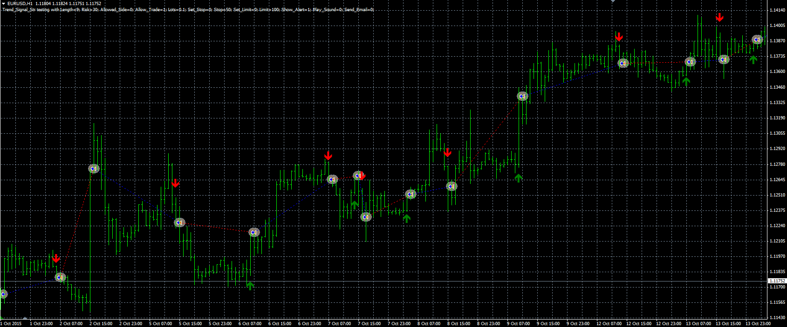

# Trend signal strategy

> Source: https://fxcodebase.com/code/viewtopic.php?f=38&t=63298  
> Forum: 38 · Topic 63298 · 1 post(s)

---

## Trend signal strategy

**Alexander.Gettinger** · Fri Mar 25, 2016 4:33 pm

The strategy based on Trend Signal indicator ([viewtopic.php?f=38&t=61514&p=101662](https://fxcodebase.com/code/viewtopic.php?f=38&t=61514&p=101662)).

Buy condition: Up signal of indicator.
Sell condition: Down signal of indicator.

 

Download:

 [Trend_Signal_Str.mq4](files/105477/Trend_Signal_Str.mq4)

The Trend Signal indicator ([viewtopic.php?f=38&t=61514&p=101662](https://fxcodebase.com/code/viewtopic.php?f=38&t=61514&p=101662)) should be installed for correct work.
