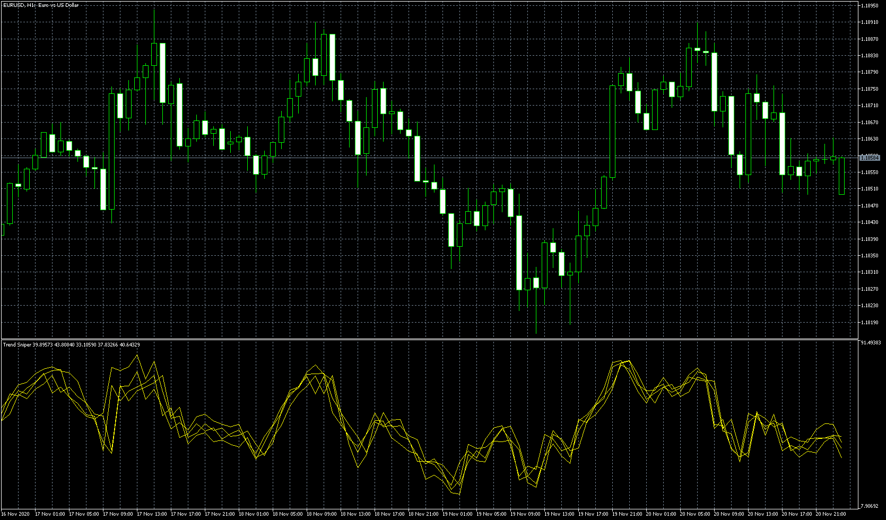

# Trend Sniper

> Source: https://fxcodebase.com/code/viewtopic.php?f=38&t=70652  
> Forum: 38 · Topic 70652 · 5 post(s)

---

## Trend Sniper

**Apprentice** · Sun Nov 22, 2020 5:35 pm

Based on request.
[viewtopic.php?f=38&t=70638](https://fxcodebase.com/code/viewtopic.php?f=38&t=70638)

 [Trend Sniper.mq5](files/139069/Trend%20Sniper.mq5)

---

## Re: Trend Sniper

**yolerap** · Tue Nov 24, 2020 11:19 am

Thank you,

Is it possible having candles instead of the lines ? Like my picture

Thank you,

---

## Re: Trend Sniper

**yolerap** · Tue Nov 24, 2020 3:25 pm

I just saw that I want is the same like this indicator : [viewtopic.php?f=17&t=60466](https://fxcodebase.com/code/viewtopic.php?f=17&t=60466)

Is it possible to combine them?

Thank you,

---

## Re: Trend Sniper

**Apprentice** · Wed Nov 25, 2020 10:59 am

Your request is added to the development list.
Development reference 2362.

---

## Re: Trend Sniper

**Apprentice** · Sun Nov 29, 2020 3:51 am

[Trend Sniper.mq5](files/139176/Trend%20Sniper.mq5)

Try this version.
