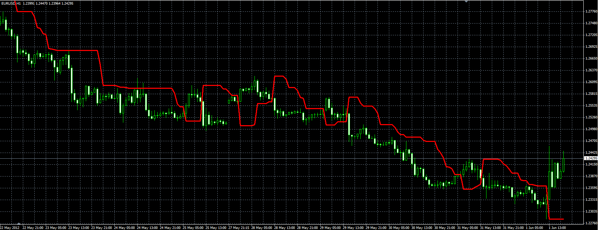

# Trend stop indicator

> Source: https://fxcodebase.com/code/viewtopic.php?f=38&t=19649  
> Forum: 38 · Topic 19649 · 20 post(s)

---

## Trend stop indicator

**Alexander.Gettinger** · Fri Jun 01, 2012 1:57 pm

Original indicator: [viewtopic.php?f=17&t=12728](https://fxcodebase.com/code/viewtopic.php?f=17&t=12728)

 

Download:

 [TrendStop.ex4](files/34744/TrendStop.ex4)

 [Trend_Stop.ex5](files/34744/Trend_Stop.ex5)

---

## Re: Trend stop indicator

**lbettl** · Tue Sep 04, 2012 11:30 am

Hi, very nice indicator, i've inserted it to my favourite signal.
It would be great if you kindly add a string to convert 4 digits to 5?

---

## Re: Trend stop indicator

**Apprentice** · Wed Sep 05, 2012 2:29 am

Your request is added to the development list.

---

## Re: Trend stop indicator

**ldemarchi** · Tue Feb 04, 2014 7:55 pm

Hello

Is It possible to add an audio and email alert function Please.

Thank You

---

## Re: Trend stop indicator

**Apprentice** · Thu Feb 06, 2014 2:25 am

Your request is added to the development list.

---

## Re: Trend stop indicator

**Alexander.Gettinger** · Tue Apr 14, 2015 11:59 am

> **ldemarchi wrote:**
> Is It possible to add an audio and email alert function Please.

The indicator with audio and Email alerts.

Download:

 [TrendStop with Alert.ex4](files/99798/TrendStop%20with%20Alert.ex4)

---

## Re: Trend stop indicator

**Knights** · Wed Aug 26, 2015 2:31 pm

One request for a great indicator: could you have the pop up alert with audio indicate which currency pair the alert is originating from? I have multiple charts in my MT4 profile, so this would make things more straight forward.
-Thanks

---

## Re: Trend stop indicator

**Apprentice** · Thu Aug 27, 2015 6:55 am

Your request is added to the development list.

---

## Re: Trend stop indicator

**Recursive Trendline** · Wed Jul 12, 2017 9:59 am

Hi apprentice,

An EA based on trendstop would be great.

Buy: Up
Sell: Down

No target, No Stop loss. But a magic number is required for mt4.

Regards,

---

## Re: Trend stop indicator

**Apprentice** · Thu Jul 13, 2017 3:33 am

Your request is added to the development list, Under Id Number 3823
 If someone is interested to do this task, please contact me.

---

## Re: Trend stop indicator

**bartwas1** · Fri Aug 04, 2017 4:56 am

Hi
I have tried this indi and sometimes it doesn't update. You need manually refresh it. Can anything be done with this issue, please? Thank you kindly.

---

## Re: Trend stop indicator

**Apprentice** · Tue Aug 08, 2017 2:52 am

Try TrendStop.ex4 now.

---

## Re: Trend stop indicator

**Alexander.Gettinger** · Wed Sep 13, 2017 3:11 pm

> **Recursive Trendline wrote:**
> Hi apprentice,
>
> An EA based on trendstop would be great.
>
> Buy: Up
> Sell: Down
>
> No target, No Stop loss. But a magic number is required for mt4.
>
> Regards,

Please, try this strategy:

 [TrendStop_Strategy.mq4](files/114889/TrendStop_Strategy.mq4)

---

## Re: Trend stop indicator

**Alexander.Gettinger** · Thu Dec 13, 2018 12:47 pm

> **Knights wrote:**
> One request for a great indicator: could you have the pop up alert with audio indicate which currency pair the alert is originating from? I have multiple charts in my MT4 profile, so this would make things more straight forward.
> -Thanks

Please, try this version of indicator:

 [TrendStop2.mq4](files/122795/TrendStop2.mq4)

You need to create sound files for each instrument. File name format: <instrument name>.wav
For example: eurusd.wav

---

## Re: Trend stop indicator

**amazon1a** · Tue Sep 10, 2019 4:32 pm

Hi Alexander,

I am not able to see the instrument attached to the Alert in the MT 4 pop-up window. The message indicates an Alert has occurred, which is either up or down, but not which pair. It is a bit of a bother since my Profile has 15 pairs.

I am not interested in audio or email functionality just the pop-up.

Can you fix this or am I missing something?

Thanks, AG

---

## Re: Trend stop indicator

**Apprentice** · Wed Sep 11, 2019 4:38 am

Your request is added to the development list.
Development reference 71.

---

## Re: Trend stop indicator

**Apprentice** · Thu Sep 12, 2019 6:56 am

[TrendStop2.mq4](files/128602/TrendStop2.mq4)

Try this version.

---

## Re: Trend stop indicator

**amazon1a** · Thu Sep 12, 2019 11:08 am

> **Apprentice wrote:**
>
>
> TrendStop2.mq4
>
>
> Try this version.

Thanks Apprentice, That has done the trick. Working great!

AG

---

## Re: Trend stop indicator

**amazon1a** · Thu Sep 12, 2019 5:21 pm

Hi Apprentice,

One more thing -- today it was particularly noticeable that Alerts were triggered with Touches/Crosses even though I have selected Close in the dialogue box.

I would like to see an Alert only after a Close opposite the Trend Stop line.

Is this possible?

Thanks, AG

---

## Re: Trend stop indicator

**Apprentice** · Fri Sep 13, 2019 5:53 am

[TrendStop2.mq4](files/128646/TrendStop2.mq4)

Try this version.
