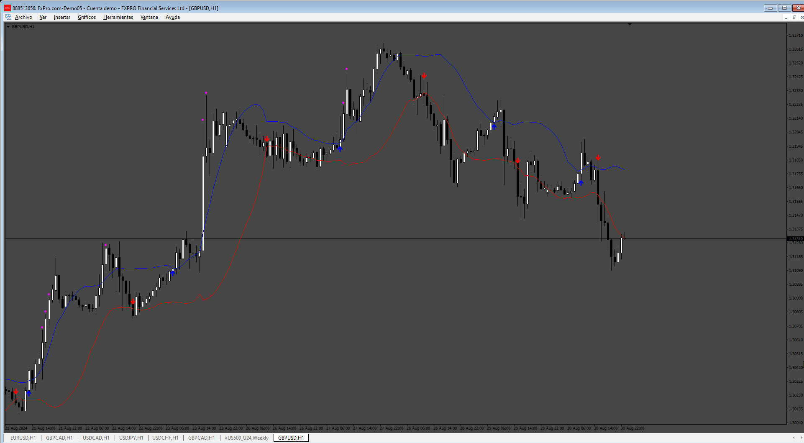
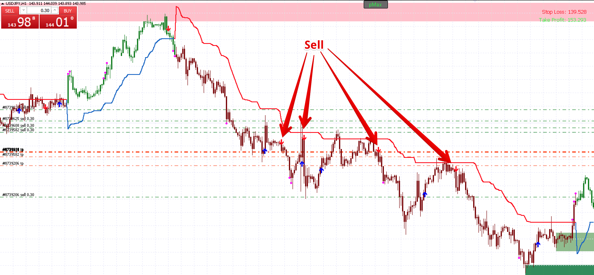
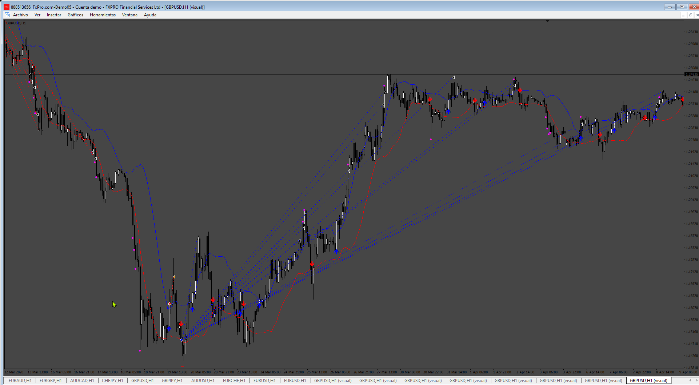
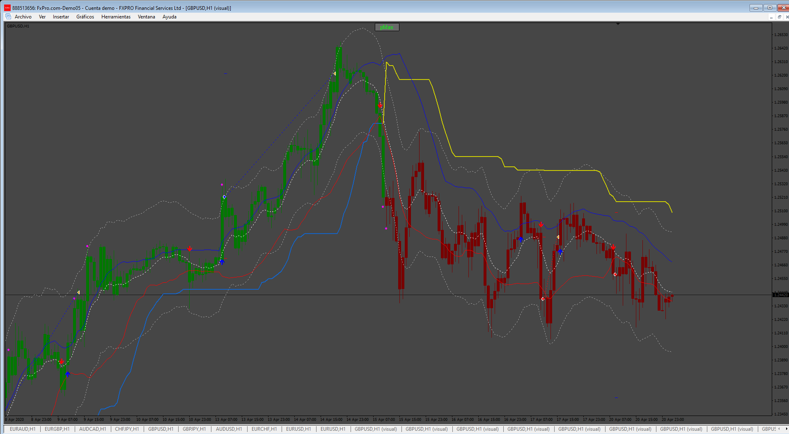
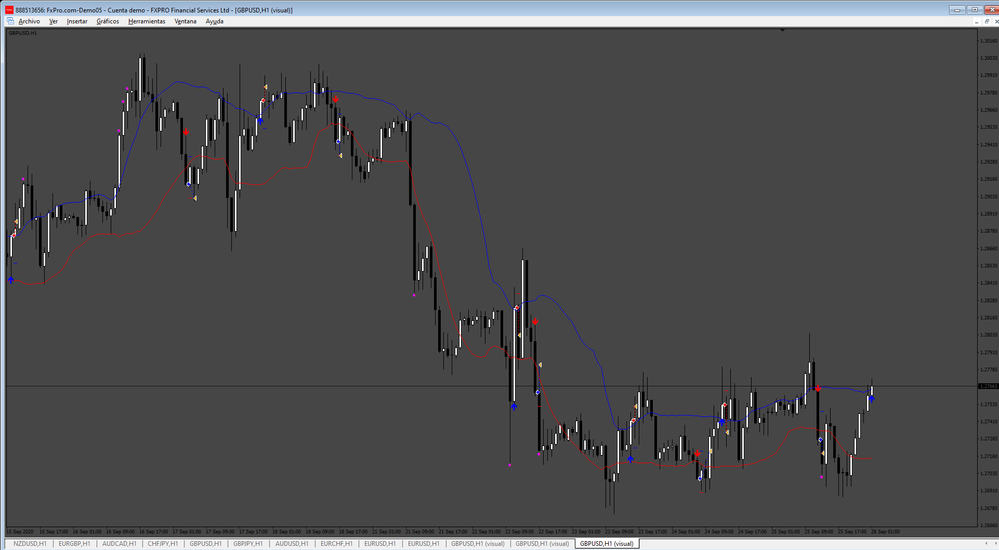

# Trend_Strength_EA

> Source: https://fxcodebase.com/code/viewtopic.php?f=38&t=75172  
> Forum: 38 · Topic 75172 · 4 post(s)

---

## Trend_Strength_EA

**Apprentice** · Sun Sep 01, 2024 2:49 pm

Based on the request.
[https://fxcodebase.com/code/viewtopic.p ... 42#p156342](https://fxcodebase.com/code/viewtopic.php?f=27&p=156342#p156342)

 [Trend_Strength.mq4](files/156550/Trend_Strength.mq4)

 [Trend_Strength_EA.mq4](files/156550/Trend_Strength_EA.mq4)

---

## Re: Trend_Strength_EA

**trtrader** · Fri Sep 20, 2024 3:55 pm

Hi, thank you so much.

Could you please add the attached indicator as a filter? and add:

- Trade reverse logic
- Close the percentage option on each take profit dot.
- Option to close trades when supertrend changes the colour.
- Day-by-day time filter with multiple time range options like 10:00-15:00, 21:00-:23:59

 

---

## Re: Trend_Strength_EA

**Apprentice** · Mon Sep 23, 2024 2:15 pm

We have added your request to the development list.
Development reference 733

---

## Re: Trend_Strength_EA

**Apprentice** · Fri Sep 27, 2024 6:14 am

 

 

 [Trend_Strength_EA_v2.mq4](files/156799/Trend_Strength_EA_v2.mq4)
