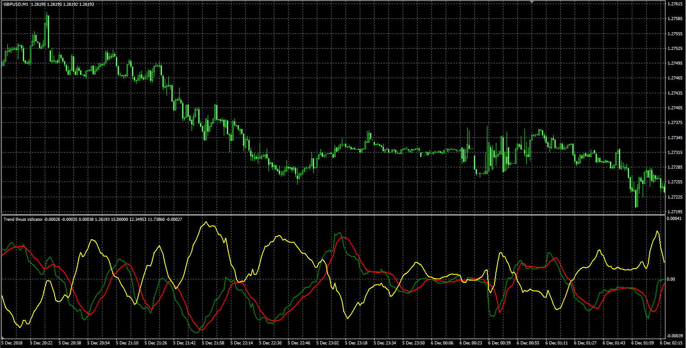

# Trend Thrust indicator

> Source: https://fxcodebase.com/code/viewtopic.php?f=38&t=67233  
> Forum: 38 · Topic 67233 · 10 post(s)

---

## Trend Thrust indicator

**Alexander.Gettinger** · Thu Jan 03, 2019 5:35 pm

Based on request: [viewtopic.php?f=27&t=67226](https://fxcodebase.com/code/viewtopic.php?f=27&t=67226)

 

Download:

 [Trend_Thrust.mq4](files/123167/Trend_Thrust.mq4)

---

## Re: Trend Thrust indicator

**logicgate** · Thu Jan 03, 2019 8:45 pm

Dear friend thanks very much for you effort. However, from the pic you posted I can see it is looking weird, I mean, that yellow line is not on the TTI, there is a histogram. Check here:

[http://edmond.mires.co/GES816/43-Trend% ... icator.pdf](http://edmond.mires.co/GES816/43-Trend%20Thrust%20Indicator.pdf)

---

## Re: Trend Thrust indicator

**logicgate** · Fri Jan 18, 2019 12:14 pm

Have you ever checked the link to compare?

---

## Re: Trend Thrust indicator

**Apprentice** · Sun Jan 20, 2019 6:02 am

What a problem.
You want a histogram instead of a line?

---

## Re: Trend Thrust indicator

**logicgate** · Sun Jan 20, 2019 2:46 pm

Hello dear friend apprentice. Yes please!

---

## Re: Trend Thrust indicator

**Apprentice** · Mon Jan 21, 2019 8:35 am

[Trend_Thrust.mq4](files/123459/Trend_Thrust.mq4)

Try this version.

---

## Re: Trend Thrust indicator

**logicgate** · Mon Jan 21, 2019 8:42 am

> **Apprentice wrote:**
>
>
> Trend_Thrust.mq4
>
>
> Try this version.

Thanks so much my friend!

---

## Re: Trend Thrust indicator

**logicgate** · Sat Aug 17, 2019 10:06 am

Hi there my friend. The indicator is not loading. In the indicator list it appears with a small gray icon that looks like a diamond, when you drag it to the chart, nothing happens.

---

## Re: Trend Thrust indicator

**Apprentice** · Sun Aug 18, 2019 8:20 am

Fixed.

---

## Re: Trend Thrust indicator

**logicgate** · Sun Aug 18, 2019 9:23 am

Working perfectly now, thanks.
