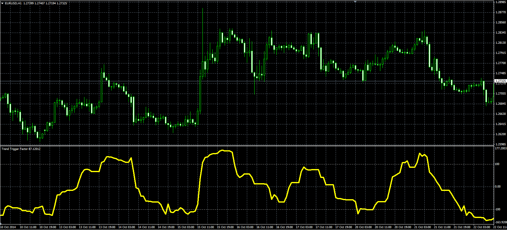

# Trend Trigger Factor

> Source: https://fxcodebase.com/code/viewtopic.php?f=38&t=61446  
> Forum: 38 · Topic 61446 · 1 post(s)

---

## Trend Trigger Factor

**Alexander.Gettinger** · Mon Nov 17, 2014 4:38 pm

Original LUA oscillator: [viewtopic.php?f=17&t=23558](https://fxcodebase.com/code/viewtopic.php?f=17&t=23558).

Formulas:
TTF = 200*(Max+Min-MaxL-MinL)/(Max+MaxL-Min-MinL), where
Min, Max - minimum and maximum prices at range from (i-Length+1) to (i),
MinL, MaxL - minimum and maximum prices at range from (i-2*Length+2) to (i-Length+1).

 

Download:

 [TTF.mq4](files/97110/TTF.mq4)
