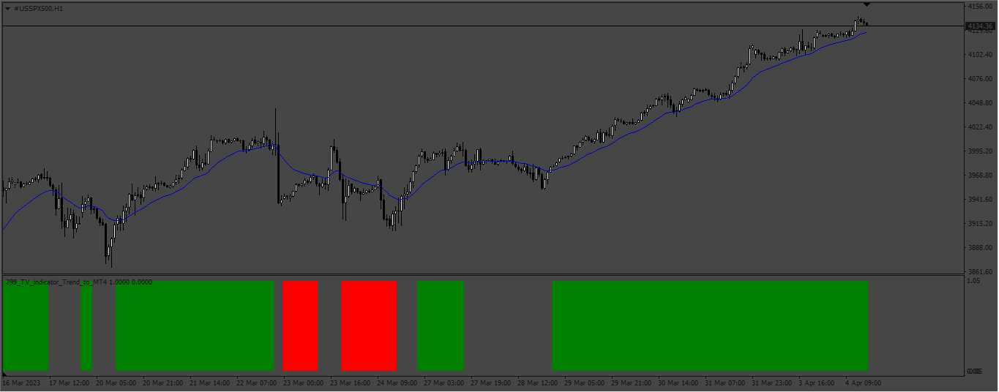
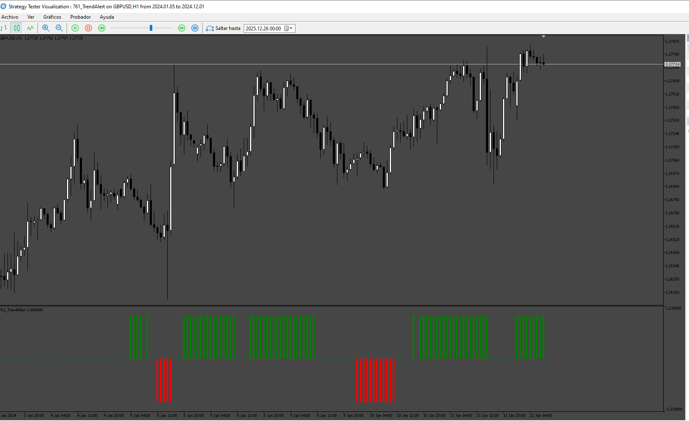

# TrendAlert

> Source: https://fxcodebase.com/code/viewtopic.php?f=38&t=73577  
> Forum: 38 · Topic 73577 · 4 post(s)

---

## TrendAlert

**Apprentice** · Fri Apr 07, 2023 2:30 pm

Based on the request.
[https://fxcodebase.com/code/viewtopic.php?f=27&p=150197](https://fxcodebase.com/code/viewtopic.php?f=27&p=150197)

 [Heiken_Ashi.mq4](files/150331/Heiken_Ashi.mq4)

 [TrendAlert.mq4](files/150331/TrendAlert.mq4)

---

## Re: TrendAlert

**mnavid** · Tue Nov 25, 2025 2:16 pm

I checked version MQL4 and it works fine but I need version MQL5 of this indicator. Please provide version 5. Thanks.

---

## Re: TrendAlert

**Apprentice** · Sat Nov 29, 2025 11:55 am

We have added your request to the development list.
Development reference 761

---

## Re: TrendAlert

**Apprentice** · Tue Dec 30, 2025 7:10 am

 [TrendAlert.mq5](files/161446/TrendAlert.mq5)
