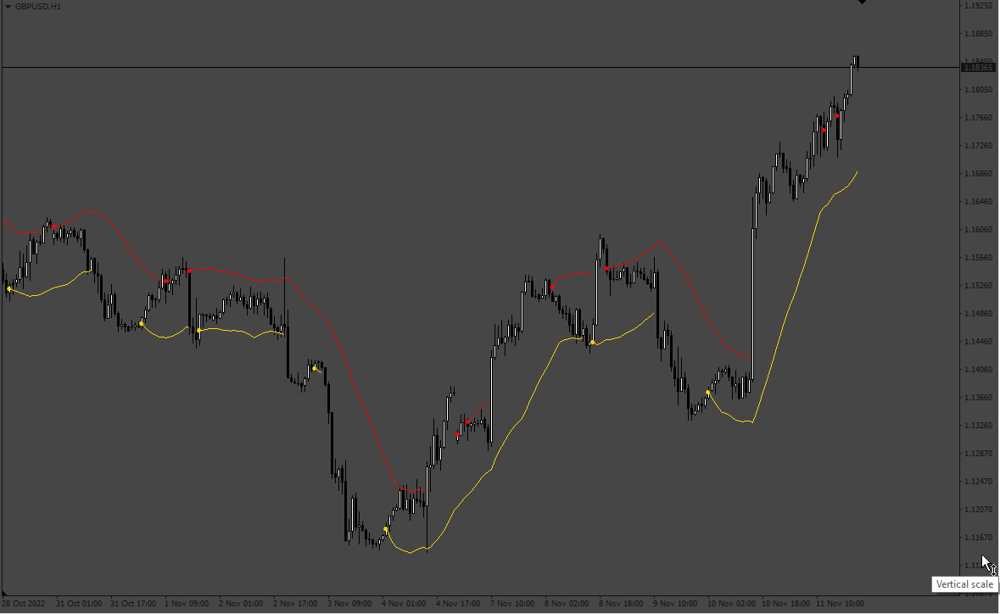
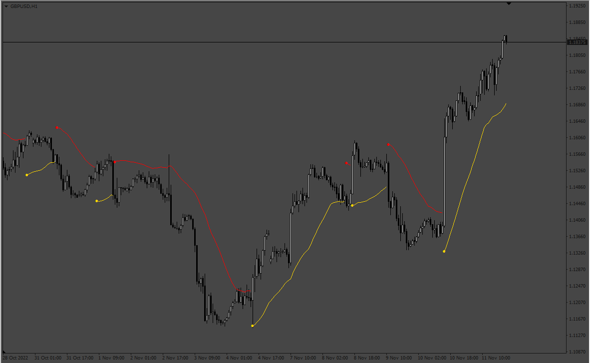

# TrendAndRange.

> Source: https://fxcodebase.com/code/viewtopic.php?f=38&t=72946  
> Forum: 38 · Topic 72946 · 4 post(s)

---

## TrendAndRange.

**Apprentice** · Mon Nov 14, 2022 4:49 pm

 

Based on source
[https://www.tradingview.com/script/1o4o ... scillator/](https://www.tradingview.com/script/1o4oWbEx-Heikin-Ashi-RSI-Oscillator/)

 [TrendAndRange.mq4](files/148336/TrendAndRange.mq4)

 [TrendAndRange.mq5](files/148336/TrendAndRange.mq5)

---

## Re: TrendAndRange.

**giova90** · Tue Aug 20, 2024 3:01 am

Hello Apprentice, could you please convert this indicator to mq5?

---

## Re: TrendAndRange.

**Apprentice** · Wed Aug 21, 2024 4:24 pm

We have added your request to the development list.
Development reference 666

---

## Re: TrendAndRange.

**Apprentice** · Tue Oct 01, 2024 4:27 am

MT5 version added.
