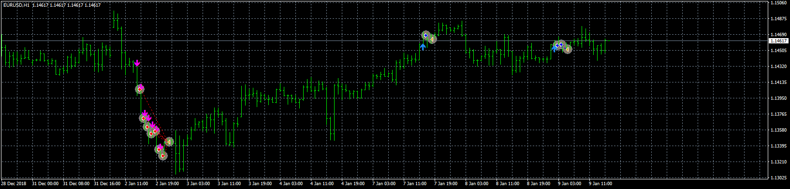
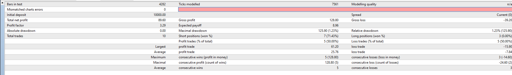

# TrendArrows EA

> Source: https://fxcodebase.com/code/viewtopic.php?f=38&t=68712  
> Forum: 38 · Topic 68712 · 8 post(s)

---

## TrendArrows EA

**Apprentice** · Thu Jul 25, 2019 2:57 pm

 

Based on request.
[viewtopic.php?f=27&t=68701](https://fxcodebase.com/code/viewtopic.php?f=27&t=68701)

 [TrendArrows.mq4](files/127554/TrendArrows.mq4)

 [TrendArrows EA.mq4](files/127554/TrendArrows%20EA.mq4)

---

## Re: TrendArrows EA

**Sp2562** · Thu Jul 25, 2019 4:15 pm

Thanks for the early development, it was great.

We need some adjustments yet, following information below.

He should give only one entry and exit at the last arrow.

Follows the rear row model of red as it should be.

You should not enter all arrows, only the first one.

The output remains the same.

---

## Re: TrendArrows EA

**Apprentice** · Mon Jul 29, 2019 6:39 am

use position cap feature for that.

---

## Re: TrendArrows EA

**AndrewOcconer** · Sun Oct 13, 2019 10:43 pm

Hi Apprentice, can you only convert the indicator to MT5? Please, thanks

---

## Re: TrendArrows EA

**Apprentice** · Mon Oct 14, 2019 4:57 am

Your request is added to the development list.
Development reference 188.

---

## Re: TrendArrows EA

**Apprentice** · Tue Oct 15, 2019 1:27 pm

[TrendArrows.mq5](files/129228/TrendArrows.mq5)

Try this version.

---

## Re: TrendArrows EA

**bruno2017** · Fri Apr 30, 2021 12:22 pm

Hello
 when I attach this EA to the graph there is 2 to 3second then disappears, does anyone have any idea of my problem.
Thank you

---

## Re: TrendArrows EA

**Apprentice** · Wed May 05, 2021 12:04 pm

I can't repeat it. Take a look in the Experts tab. There should be an error
