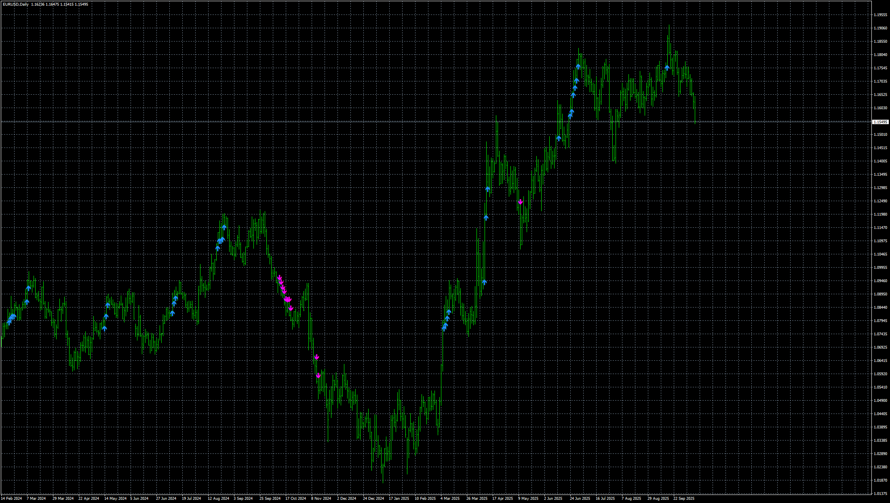

# TrendArrows

> Source: https://fxcodebase.com/code/viewtopic.php?f=38&t=76418  
> Forum: 38 · Topic 76418 · 4 post(s)

---

## TrendArrows

**Apprentice** · Thu Oct 30, 2025 4:20 am

Based on the request.
[https://fxcodebase.com/code/viewtopic.php?f=38&t=76374](https://fxcodebase.com/code/viewtopic.php?f=38&t=76374)

 [TrendArrows.mq4](files/161108/TrendArrows.mq4)

---

## Re: TrendArrows

**phnthnhnm** · Fri Oct 31, 2025 9:55 pm

Dear expert,
May I ask MT5 version of this indicator.
Thank you.

---

## Re: TrendArrows

**Apprentice** · Sun Nov 09, 2025 8:32 am

We have added your request to the development list.
Development reference 721

---

## Re: TrendArrows

**Apprentice** · Sat Nov 22, 2025 4:06 pm

[TrendArrows.mq5](files/161272/TrendArrows.mq5)
