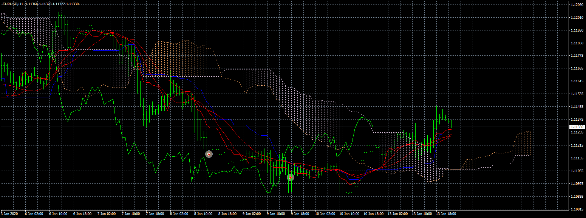
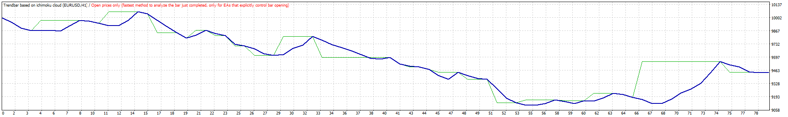
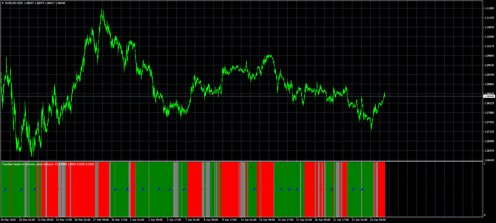

# Trendbar based on ichimoku cloud EA

> Source: https://fxcodebase.com/code/viewtopic.php?f=38&t=69721  
> Forum: 38 · Topic 69721 · 1 post(s)

---

## Trendbar based on ichimoku cloud EA

**Apprentice** · Thu Apr 23, 2020 5:03 am

 

Based on request
[viewtopic.php?f=27&t=69693](https://fxcodebase.com/code/viewtopic.php?f=27&t=69693)

 [Trendbar based on ichimoku cloud.mq4](files/133108/Trendbar%20based%20on%20ichimoku%20cloud.mq4)

 

 [Trendbar based on ichimoku cloud Indicator.mq4](files/133108/Trendbar%20based%20on%20ichimoku%20cloud%20Indicator.mq4)
