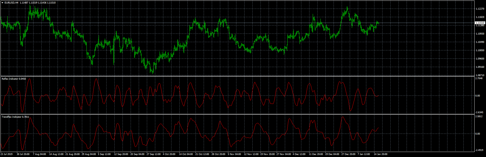

# Trendflex / REFLEX

> Source: https://fxcodebase.com/code/viewtopic.php?f=38&t=69323  
> Forum: 38 · Topic 69323 · 1 post(s)

---

## Trendflex / REFLEX

**Apprentice** · Thu Jan 16, 2020 5:01 am

[viewtopic.php?f=17&t=69318](https://fxcodebase.com/code/viewtopic.php?f=17&t=69318)
Based on TS2/Lua version.
Based on the article, It’s Faster! Reflex: A New
Zero-Lag Indicator by John F. Ehlers, February 2020 edition of S&C MAgazine

 [Trendflex_Indicator.mq4](files/130756/Trendflex_Indicator.mq4)

 [REFLEX_INDICATOR.mq4](files/130756/REFLEX_INDICATOR.mq4)

 [Trendflex_Indicator.mq5](files/130756/Trendflex_Indicator.mq5)

 [REFLEX_INDICATOR.mq5](files/130756/REFLEX_INDICATOR.mq5)
