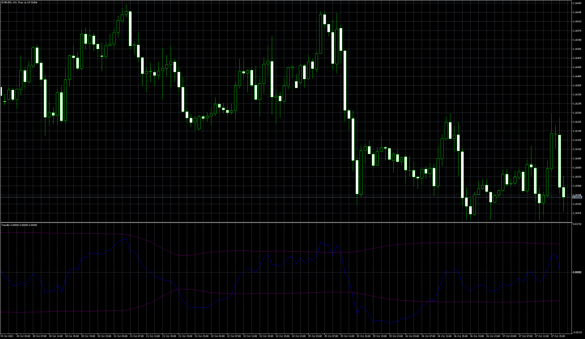
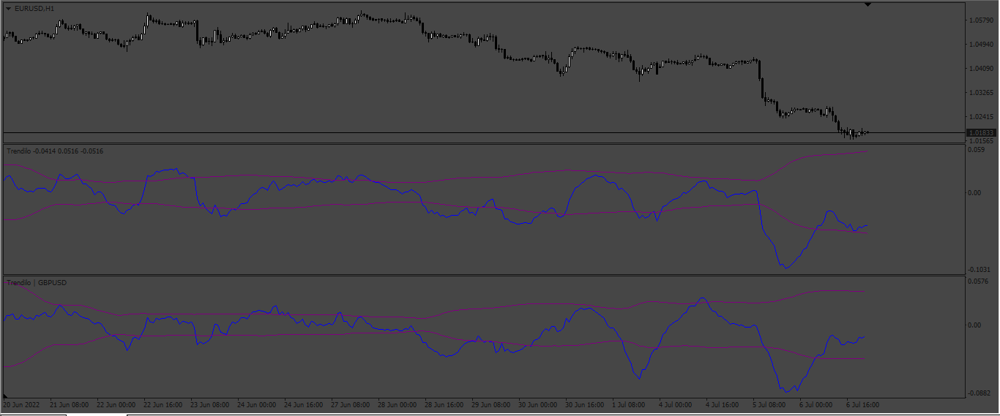

# Trendilo

> Source: https://fxcodebase.com/code/viewtopic.php?f=38&t=71595  
> Forum: 38 · Topic 71595 · 11 post(s)

---

## Trendilo

**Apprentice** · Wed Oct 27, 2021 10:47 am

Based on the request.
[https://fxcodebase.com/code/viewtopic.p ... 95#p143895](https://fxcodebase.com/code/viewtopic.php?f=27&p=143895#p143895)

 [Trendilo.mq4](files/144054/Trendilo.mq4)

 [Trendilo.mq5](files/144054/Trendilo.mq5)

TS2 version
[https://fxcodebase.com/code/viewtopic.php?f=17&t=73591](https://fxcodebase.com/code/viewtopic.php?f=17&t=73591)

---

## Re: Trendilo

**sathistrader** · Fri Jul 01, 2022 2:45 am

**This indicator is very nice and helpful,
I tried to modify code to make choose different symbol than in the current chart symbol.

> If possible add option to choose different symbol
> eg: current chart display candle for EURUSD but Trendilo should show result for USDJPY(Manual input).**

---

## Re: Trendilo

**Apprentice** · Sun Jul 03, 2022 5:00 am

As a table view / dashboard or as a oscillator?

---

## Re: Trendilo

**sathistrader** · Sun Jul 03, 2022 5:15 am

**Oscillator**

---

## Re: Trendilo

**Apprentice** · Mon Jul 04, 2022 5:17 pm

We have added your request to the development list.
Development reference 404.

---

## Re: Trendilo

**Apprentice** · Mon Jul 11, 2022 3:47 am

 [Trendilo.mq4](files/146681/Trendilo.mq4)

 [TrendiloOtherPair.mq4](files/146681/TrendiloOtherPair.mq4)

---

## Re: Trendilo

**sathistrader** · Wed Jul 20, 2022 10:38 am

**Thanks bro it works fine.**

---

## Re: Trendilo

**xristos1982** · Wed Apr 05, 2023 2:27 pm

> **Apprentice wrote:**
>
>
> 404pic.png
>
>
>
>
> Trendilo.mq4
>
>
>
>
> TrendiloOtherPair.mq4

Can i have this in lua?

---

## Re: Trendilo

**FabioE** · Fri Apr 07, 2023 5:11 am

Hello,
would it be possible to get a LUA version for this indicator?

---

## Re: Trendilo

**Apprentice** · Wed Apr 12, 2023 4:01 am

We have added your request to the development list.
Development reference 325.

---

## Re: Trendilo

**Apprentice** · Wed Apr 12, 2023 8:12 am

TS2 version
[https://fxcodebase.com/code/viewtopic.php?f=17&t=73591](https://fxcodebase.com/code/viewtopic.php?f=17&t=73591)
