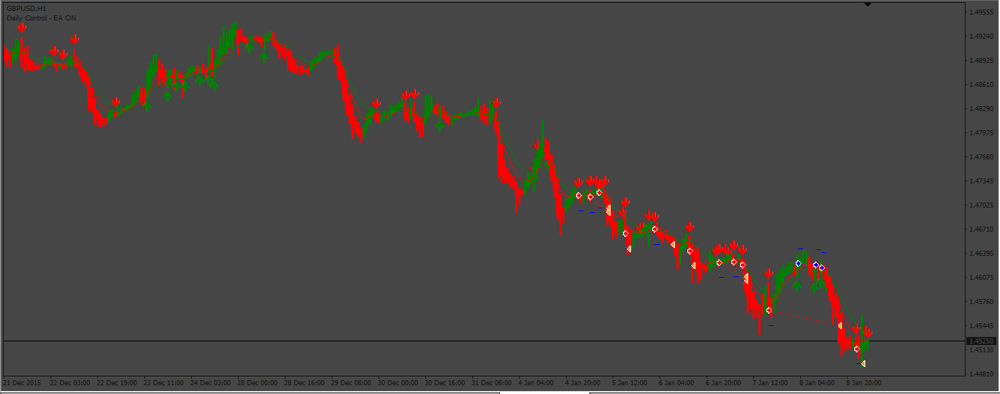

# TrendIndicator_EA

> Source: https://fxcodebase.com/code/viewtopic.php?f=38&t=73071  
> Forum: 38 · Topic 73071 · 4 post(s)

---

## TrendIndicator_EA

**Apprentice** · Thu Dec 22, 2022 11:15 am

Based on the request.
[https://fxcodebase.com/code/viewtopic.php?f=27&p=148686](https://fxcodebase.com/code/viewtopic.php?f=27&p=148686)

 [TrendIndicator.mq4](files/148776/TrendIndicator.mq4)

 [TrendIndicator_EA.mq4](files/148776/TrendIndicator_EA.mq4)

---

## Re: TrendIndicator_EA

**SMZUBAYER** · Sat Mar 25, 2023 3:37 pm

Hey there,
great job sir. would you please add only 2 things to this ea? that might help us I believe.
add an equity guard with it. for example :
total equity gain take profit and total equity loss equity protector.

there is an option to choose.....if the total equity increases "x" amount of money or percentage, close all open orders. and opening orders again .
and also if the total equity losses x amount of money or percentage it will close all the open orders.

and it will start tracking the equity increase or loss since when there is 0 open orders.
god bless you again and again.

---

## Re: TrendIndicator_EA

**Apprentice** · Tue Mar 28, 2023 9:47 am

We have added your request to the development list.
Development reference 286.

---

## Re: TrendIndicator_EA

**Apprentice** · Sat Apr 01, 2023 9:08 am

[37596](files/150230/286pic.png)

 [TrendIndicator_EA.mq4](files/150230/TrendIndicator_EA.mq4)
