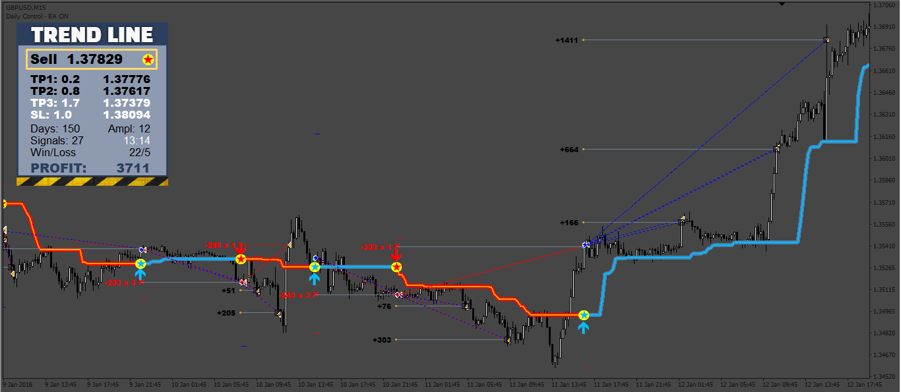

# TrendLine_PRO_EA

> Source: https://fxcodebase.com/code/viewtopic.php?f=38&t=71860  
> Forum: 38 · Topic 71860 · 8 post(s)

---

## TrendLine_PRO_EA

**Apprentice** · Mon Feb 07, 2022 3:29 am

Based on the request.
[https://fxcodebase.com/code/viewtopic.php?f=27&p=144550](https://fxcodebase.com/code/viewtopic.php?f=27&p=144550)

 [TrendLine_PRO_MT4.ex4](files/144962/TrendLine_PRO_MT4.ex4)

 [TrendLine_PRO_EA.mq4](files/144962/TrendLine_PRO_EA.mq4)

---

## Re: TrendLine_PRO_EA

**papaprabu** · Fri Feb 11, 2022 10:31 pm

broker octafx
cannot load the indicator in my mt4 like in picture

---

## Re: TrendLine_PRO_EA

**nnbite** · Sat Feb 12, 2022 11:04 am

thx bro

---

## Re: TrendLine_PRO_EA

**nnbite** · Tue Feb 15, 2022 4:20 am

> **papaprabu wrote:**
> broker octafx
> cannot load the indicator in my mt4 like in picture

can be load here.
Based on the request.
[https://fxcodebase.com/code/viewtopic.php?f=27&p=144550](https://fxcodebase.com/code/viewtopic.php?f=27&p=144550)

---

## Re: TrendLine_PRO_EA

**nnbite** · Wed Feb 16, 2022 10:15 am

Hi Apprentice
thank you for help
I hope you can create ea Dashboards can be obtained from this indicator.

---

## Re: TrendLine_PRO_EA

**rickCreations** · Tue May 09, 2023 1:52 am

> **Apprentice wrote:**
>
>
> TrendLineEA.png
>
>
> Based on the request.
> [https://fxcodebase.com/code/viewtopic.php?f=27&p=144550](https://fxcodebase.com/code/viewtopic.php?f=27&p=144550)
>
>
> TrendLine_PRO_MT4.ex4
>
>
>
>
> TrendLine_PRO_EA.mq4

The indicator that was used to make this Expert Advisor is a paid product so nobody can use the indicator unless they have already purchased it on mql5 store? if its possible to decompile the indicator that would be the best suggestion so that we can compile it on our own machine so that then the EA will work otherwise the only person who can benefit from this is the 1 person who requested the project and not the community.

---

## Re: TrendLine_PRO_EA

**Apprentice** · Tue May 09, 2023 12:22 pm

We can write it from scratch,
if you have a detailed description of it.

---

## Re: TrendLine_PRO_EA

**rickCreations** · Tue May 09, 2023 12:52 pm

> **Apprentice wrote:**
> We can write it from scratch,
> if you have a detailed description of it.

Use the indicator from opening post it is the original he also posted a picture I don’t know if it’s possible or not. It might be to much time consuming
