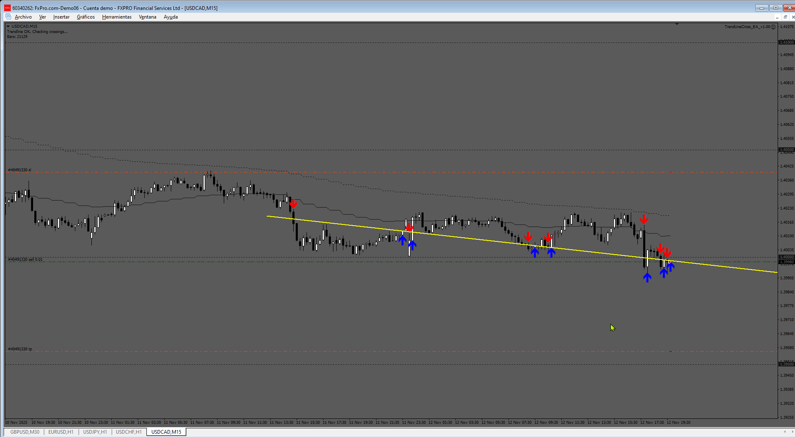

# TrendLineCross_EA_v1.00

> Source: https://fxcodebase.com/code/viewtopic.php?f=38&t=76361  
> Forum: 38 · Topic 76361 · 4 post(s)

---

## TrendLineCross_EA_v1.00

**Apprentice** · Thu Oct 09, 2025 2:20 pm

TS2 version.
[https://fxcodebase.com/code/viewtopic.p ... 73#p160673](https://fxcodebase.com/code/viewtopic.php?f=17&p=160673#p160673)

The indicator writes in the comment that it creates the trendline with two clicks, and when it breaks, it places the arrow.
The EA writes in the comment that the indicator must be attached to the chart — it requires two clicks, and from then on, the EA enters when the trendline is broken.

 [TrendLineCross_v2.mq4](files/160817/TrendLineCross_v2.mq4)

 [TrendLineCross_EA_v1.00.mq4](files/160817/TrendLineCross_EA_v1.00.mq4)

---

## Re: TrendLineCross_EA_v1.00

**khanatd** · Mon Nov 03, 2025 5:42 am

hI SIR it is not trading on arrow signals of IFX_ActualguideTrendlines by forexstation mt4 file

can u recheck plz

thanks a lot
khan

---

## Re: TrendLineCross_EA_v1.00

**Apprentice** · Sun Nov 09, 2025 8:27 am

We have added your request to the development list.
Development reference 718

---

## Re: TrendLineCross_EA_v1.00

**Apprentice** · Sun Nov 16, 2025 3:40 pm

 [TrendLineCross_EA_v1.00.mq4](files/161241/TrendLineCross_EA_v1.00.mq4)
