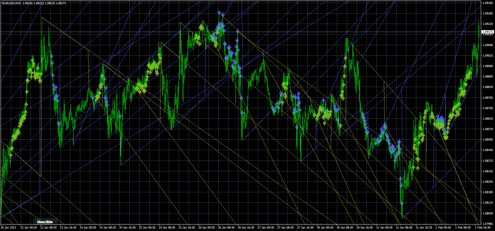

# Trendlines_with_Breaks_[LuxAlgo]

> Source: https://fxcodebase.com/code/viewtopic.php?f=38&t=74159  
> Forum: 38 · Topic 74159 · 2 post(s)

---

## Trendlines_with_Breaks_[LuxAlgo]

**Apprentice** · Wed Sep 13, 2023 8:40 am

Based on the request.
[https://fxcodebase.com/code/viewtopic.p ... 99#p150999](https://fxcodebase.com/code/viewtopic.php?f=27&p=150999#p150999)

 [Trendlines_with_Breaks_(LuxAlgo).mq4](files/152566/Trendlines_with_Breaks_LuxAlgo.mq4)

---

## Re: Trendlines_with_Breaks_[LuxAlgo]

**Apprentice** · Wed Jan 15, 2025 5:45 am

Indicator based EA
[https://fxcodebase.com/code/viewtopic.p ... 30#p157830](https://fxcodebase.com/code/viewtopic.php?f=38&t=75505&p=157830#p157830)
