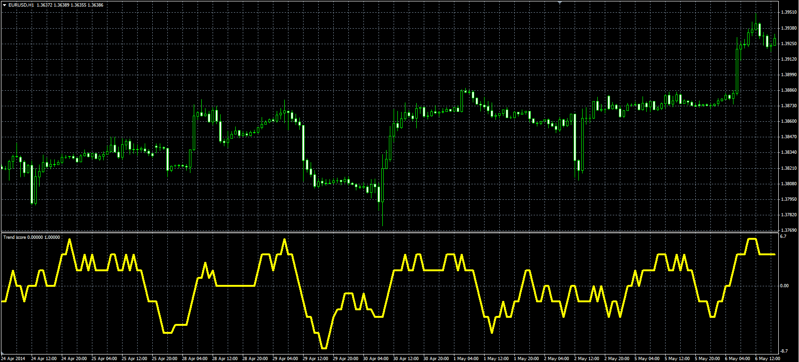

# TrendScore oscillator

> Source: https://fxcodebase.com/code/viewtopic.php?f=38&t=60798  
> Forum: 38 · Topic 60798 · 4 post(s)

---

## TrendScore oscillator

**Alexander.Gettinger** · Fri Jun 06, 2014 3:35 pm

Original LUA oscillator: [viewtopic.php?f=17&t=33942](https://fxcodebase.com/code/viewtopic.php?f=17&t=33942).

 

Download:

 [Trend_Score.mq4](files/94377/Trend_Score.mq4)

---

## Re: TrendScore oscillator

**amvt85** · Tue Apr 18, 2017 8:41 am

Hello,

Can you help me put adjustable levels on this indicator? Like ob/os levels? If only if you have the time.

Thank you very much.

---

## Re: TrendScore oscillator

**Apprentice** · Tue Apr 18, 2017 12:19 pm

Try it now.

---

## Re: TrendScore oscillator

**amvt85** · Wed Apr 19, 2017 4:03 am

> **Apprentice wrote:**
> Try it now.

Thank you for your kindness once again!
