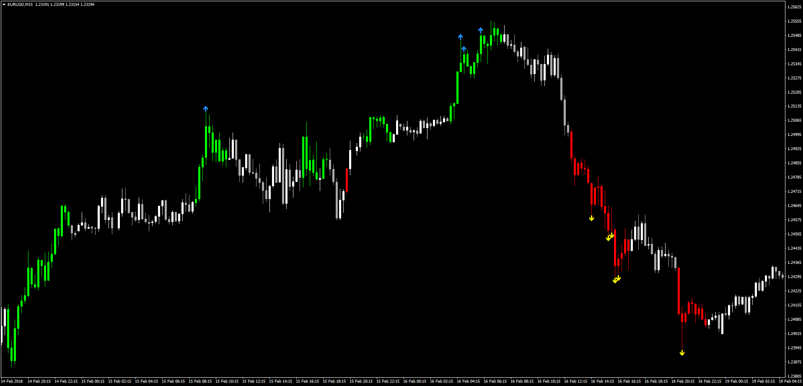

# Trendy

> Source: https://fxcodebase.com/code/viewtopic.php?f=38&t=65761  
> Forum: 38 · Topic 65761 · 1 post(s)

---

## Trendy

**Apprentice** · Sat Feb 24, 2018 6:19 am

LUA Original: [viewtopic.php?f=17&t=4385](https://fxcodebase.com/code/viewtopic.php?f=17&t=4385)

Description:

This MT4 version of the LUA Original will color the candles according to the MACD Trend.

1.Position of the MACD signal line.

Up Trend
SIGNAL < MACD and SIGNAL> 0
Down Trend
SIGNAL> MACD and SIGNAL <0
ELSE
Neutral

2.RSI Overbought / Oversold Conditions
Overbought
RSI> 75
Oversold
RSI <25

 [Trendy.mq4](files/117893/Trendy.mq4)
