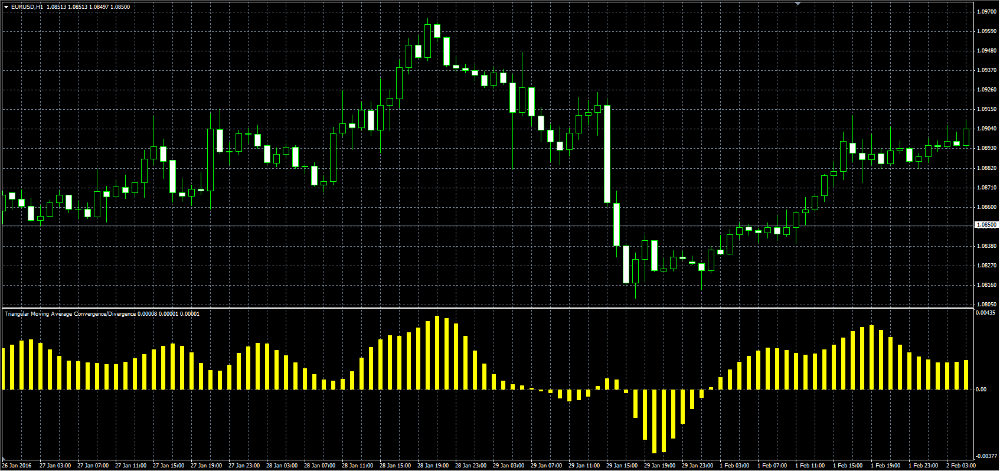

# Triangular Moving Average Convergence/Divergence

> Source: https://fxcodebase.com/code/viewtopic.php?f=38&t=63202  
> Forum: 38 · Topic 63202 · 1 post(s)

---

## Triangular Moving Average Convergence/Divergence

**Alexander.Gettinger** · Wed Mar 02, 2016 1:44 pm

This is a classic MACD indicator, but instead of EMA used TMA (Triangular Moving Average).

 

Download:

 [TMACD.mq4](files/105065/TMACD.mq4)
