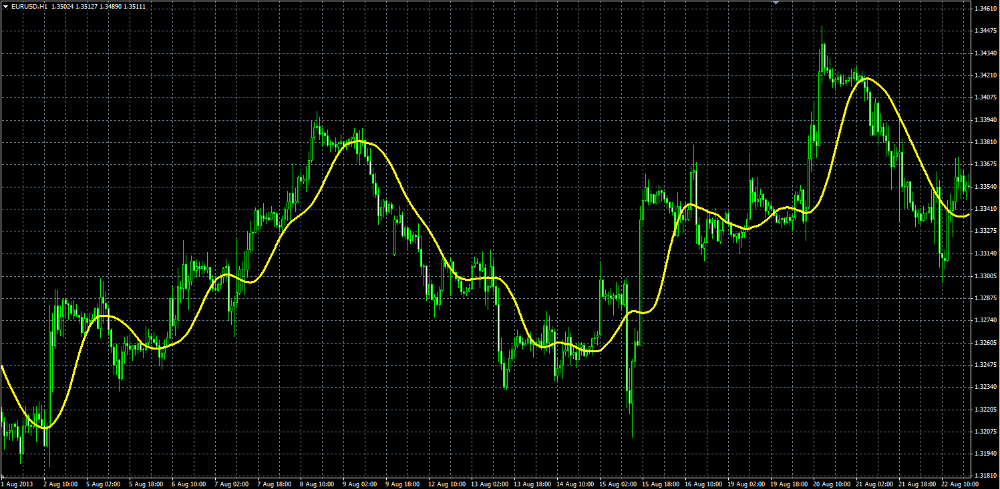

# Triangular Moving Average

> Source: https://fxcodebase.com/code/viewtopic.php?f=38&t=59965  
> Forum: 38 · Topic 59965 · 1 post(s)

---

## Triangular Moving Average

**Alexander.Gettinger** · Mon Nov 25, 2013 2:38 pm

TriMAgen - Triangular Moving Average generalized by J.Ehlers.

Formulas:
TriMAgen[i]=Sum/(len+1), where
Sum=MVA(i,len)+MVA(i-1,len)+…+MVA(i-len,len), where
MVA(i,Length) – Simple Moving Average,
len=(Length+1)/2.

 

Download:

 [TriMAgen.mq4](files/91099/TriMAgen.mq4)
