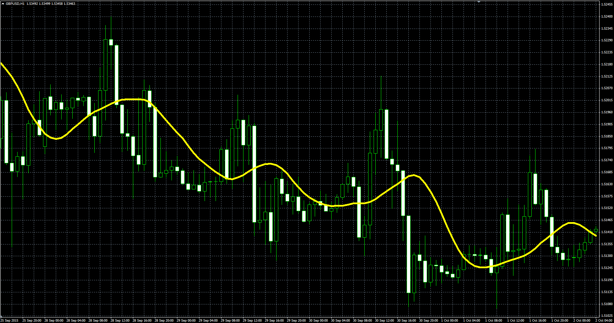

# Triangular Moving Average

> Source: https://fxcodebase.com/code/viewtopic.php?f=38&t=62775  
> Forum: 38 · Topic 62775 · 1 post(s)

---

## Triangular Moving Average

**Alexander.Gettinger** · Mon Oct 12, 2015 2:15 pm

Triangular Moving Average (TMA).

Formula:
TMA[i]=(MVA(i,len)+MVA(i-1,len)+…+MVA(i-len+1,len))/len, where
MVA(i,N) – Simple Moving Average,
len=(N+1)/2.

 

Download:

 [TMA.mq4](files/102799/TMA.mq4)
