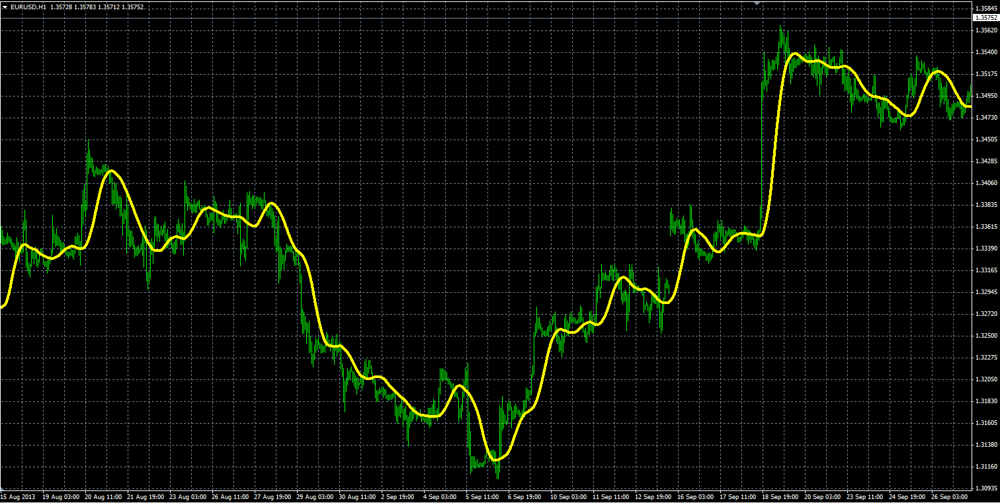

# Triangular Moving Average

> Source: https://fxcodebase.com/code/viewtopic.php?f=38&t=59627  
> Forum: 38 · Topic 59627 · 1 post(s)

---

## Triangular Moving Average

**Alexander.Gettinger** · Wed Oct 09, 2013 9:51 am

Formulas:
TriMA[i]=(MVA(i,N)+MVA(i-1,N)+…+MVA(i-N+1,N))/N, where
MVA(i,N) – Simple Moving Average,
N=(Length+1)/2.

 

Download:

 [TriMA.mq4](files/89909/TriMA.mq4)
