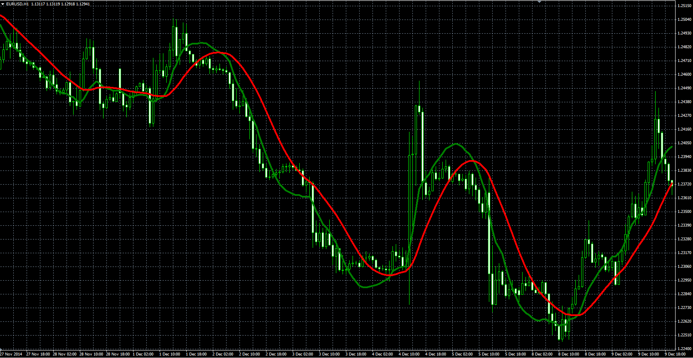

# Triggerlines indicator

> Source: https://fxcodebase.com/code/viewtopic.php?f=38&t=61982  
> Forum: 38 · Topic 61982 · 1 post(s)

---

## Triggerlines indicator

**Alexander.Gettinger** · Mon Mar 09, 2015 3:58 pm

Original LUA indicator: [viewtopic.php?f=17&t=61244](https://fxcodebase.com/code/viewtopic.php?f=17&t=61244).

Formulas:
WT = 6*sum/K,
Signal = EMA(WT) with [MA_Length] number of periods, where
sum = Sum((j-lv)*Price(i-Length+j)) for j=1..Length,
lv = (Length+1)/3,
K = Length*(Length+1).

 

Download:

 [Triggerlines.mq4](files/99141/Triggerlines.mq4)
