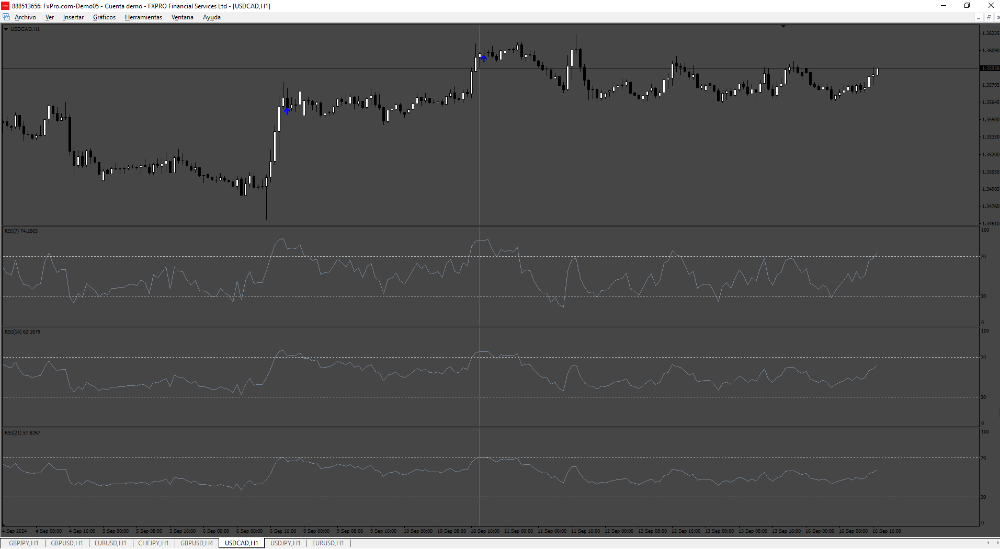
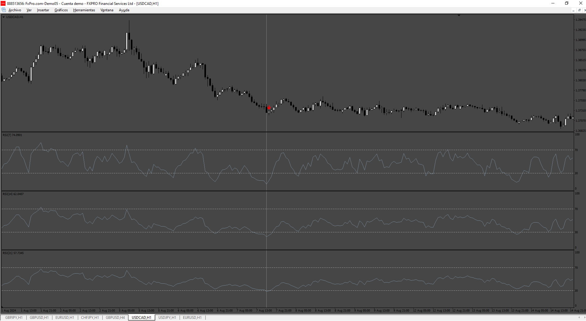

# Triple_RSI_arrows

> Source: https://fxcodebase.com/code/viewtopic.php?f=38&t=75222  
> Forum: 38 · Topic 75222 · 12 post(s)

---

## Triple_RSI_arrows

**Apprentice** · Wed Sep 18, 2024 3:38 pm

 

Based on the request.
[https://fxcodebase.com/code/viewtopic.p ... 61#p156661](https://fxcodebase.com/code/viewtopic.php?f=38&p=156661#p156661)

 [Triple_RSI_arrows.mq4](files/156734/Triple_RSI_arrows.mq4)

---

## Re: Triple_RSI_arrows

**Dan19900** · Thu Sep 19, 2024 2:01 am

Hello again, now all the rsi cross a certain level at the same time, i wanted to be like this:

Like a cross of moving averages

Buy when all 3 RSI Cross eachother upward
Sell when all 3 RSI Cross eachother downard

Apply to price for all 3 RSI

See photo attached.

---

## Re: Triple_RSI_arrows

**Sohagbd221** · Thu Sep 19, 2024 7:37 am

sound aalert not working please fix this

---

## Re: Triple_RSI_arrows

**Apprentice** · Mon Sep 23, 2024 2:27 pm

We have added your request to the development list.
Development reference 739

---

## Re: Triple_RSI_arrows

**Jirge27** · Tue Sep 24, 2024 5:14 am

It would be good to have the option of different timeframes. RSI 7 in a 5-timeframe, 14 in 15 minutes and 21 in 1 hour. As an example. And maybe as an EA.

---

## Re: Triple_RSI_arrows

**Apprentice** · Fri Sep 27, 2024 6:16 am

[Triple_RSI_arrowsv2.mq4](files/156800/Triple_RSI_arrowsv2.mq4)

Try this version.

---

## Re: Triple_RSI_arrows

**Dan19900** · Mon Sep 30, 2024 7:08 am

Hello again, it doesn't work like it should, no level should be included just the cross of eachother RSi at the same time like some EMA cross:
The level doesn't matter, whenever all 3 rsi cross eachother then arrow should appear

See photo attached.

---

## Re: Triple_RSI_arrows

**Apprentice** · Tue Oct 01, 2024 5:28 am

We have added your request to the development list.
Development reference 742

---

## Re: Triple_RSI_arrows

**Apprentice** · Tue Oct 22, 2024 11:35 am

Try this version.

 [Triple_RSI_arrowsv3.mq4](files/157048/Triple_RSI_arrowsv3.mq4)

---

## Re: Triple_RSI_arrows

**VuxxLong** · Thu Oct 24, 2024 9:56 pm

Could you please convert this EA for MT5?
Thanks

---

## Re: Triple_RSI_arrows

**Apprentice** · Thu Oct 31, 2024 8:43 am

We have added your request to the development list.
Development reference 818

---

## Re: Triple_RSI_arrows

**Apprentice** · Sun Nov 10, 2024 2:35 pm

 [Triple_RSI_arrows.mq5](files/157220/Triple_RSI_arrows.mq5)

 [Triple_RSI_arrows_EA_v1.00.mq5](files/157220/Triple_RSI_arrows_EA_v1.00.mq5)
