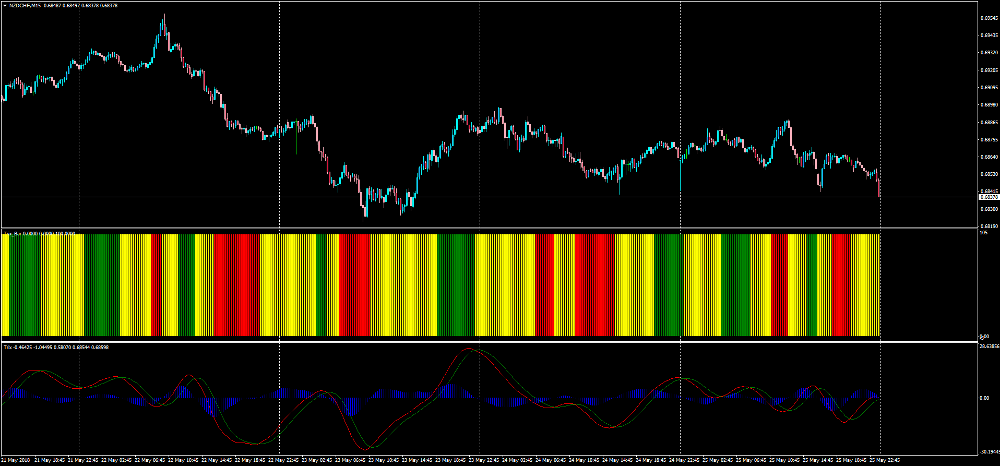

# Trix Bar

> Source: https://fxcodebase.com/code/viewtopic.php?f=38&t=66149  
> Forum: 38 · Topic 66149 · 1 post(s)

---

## Trix Bar

**Apprentice** · Sun May 27, 2018 6:13 pm

LUA Original: [viewtopic.php?f=17&t=11367](https://fxcodebase.com/code/viewtopic.php?f=17&t=11367)

Description:

MT4 version of the LUA original Trix indicator displaying a histogram according to these conditions:

trix line > signal line and signal line> 0--------green
trix line> signal line and signal line< 0------- yellow
trix line< signal line and signal line < 0 ------red
trix line < signal line and signal line > 0-----yellow

Note: It is required to install the Trix.mq4 indicator in the same indicators folder: [viewtopic.php?f=38&t=20395](https://fxcodebase.com/code/viewtopic.php?f=38&t=20395)

 [Trix_Bar.mq4](files/119370/Trix_Bar.mq4)
