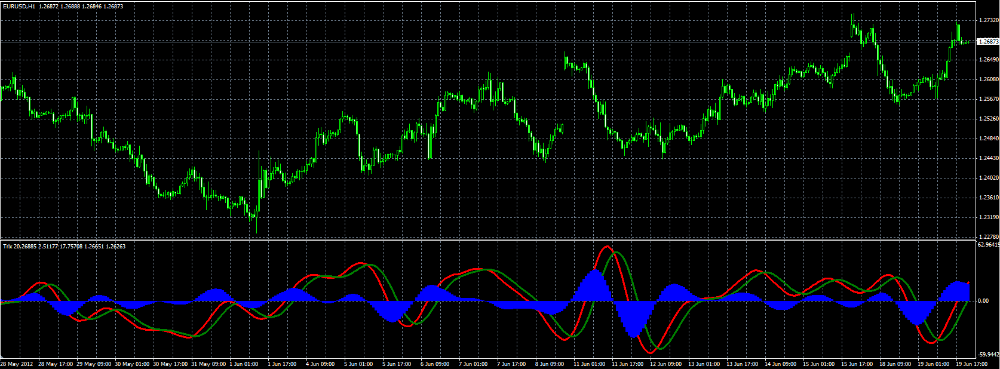
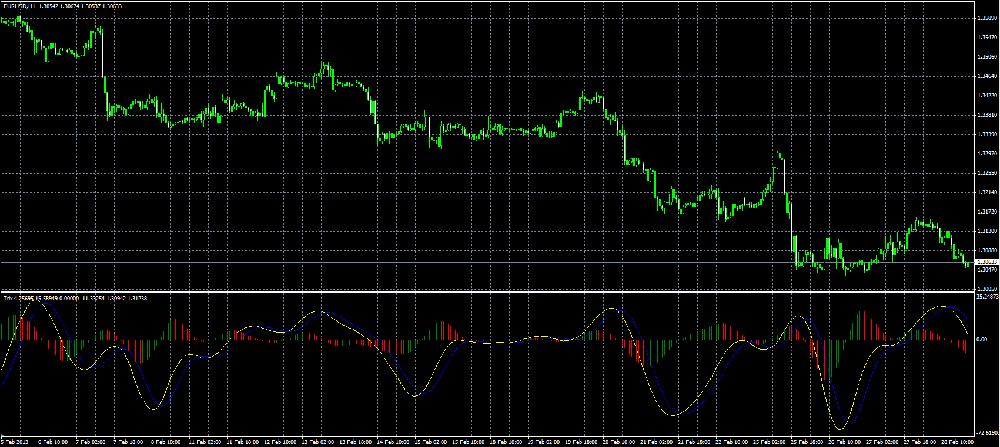
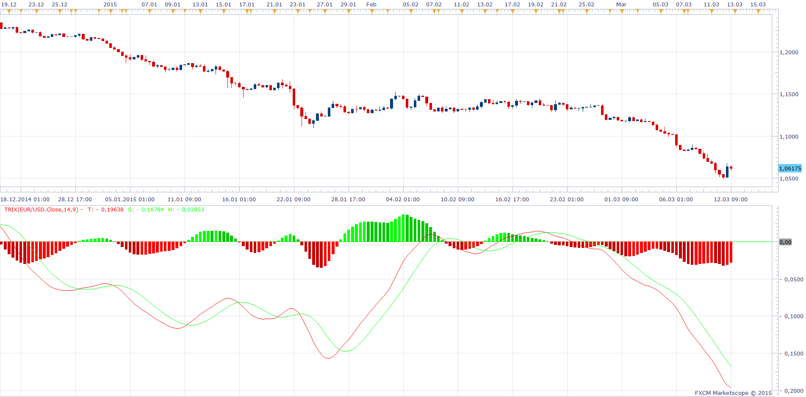

# Trix

> Source: https://fxcodebase.com/code/viewtopic.php?f=38&t=20395  
> Forum: 38 · Topic 20395 · 12 post(s)

---

## Trix

**Alexander.Gettinger** · Tue Jun 19, 2012 5:32 pm

Original indicator: [viewtopic.php?f=17&t=1022](https://fxcodebase.com/code/viewtopic.php?f=17&t=1022)

> The TRIX Indicator was developed in the early 1980s by Jack Hutson who was an editor for the Technical Analysis of Stocks and Commodities magazine. Its name is comprised of its calculation: Triple Exponential.
>
> The trix indicator is a tripple-smoothed price weighted against the previous tripple-smoothed price:
> TrMA = (EMA(EMA(EMA(price, N), N), N)
> TRIX(N)i = (TrMAi - TrMAi - 1) / TrMAi - 1).
> SIGNAL(N, S) = SMA(TRIX(N), S)
>
> HISTOGRAM = TRIX - SIGNAL
>
> The formula is from Appel, Gerald: Winning Stock Market Systems. Signalert Corp., Great Neck, N.Y. 1974.
>
> The implementation lets you choose methods individually for each moving average. Please note that the methods marked using (*) requires the corresponding indicators to be downloaded and installed.
>
> The common trading rule is:
> Buy when TRIX is below zero and crosses its Signal Line from below.
> Sell when TRIX is above zero and crosses its Signal Line from above.

 

Download:

 [Trix.mq4](files/35762/Trix.mq4)

---

## Re: Trix

**lrathi** · Tue Feb 12, 2013 1:17 am

Is it possible to have the histogram coloured bars like MACD?

The coloued bars to be when the next bar is lower value to previous bar to be RED and vice versa for when the next bar is higher than previous bar for it to change to green.

Many thanks

---

## Re: Trix

**Alexander.Gettinger** · Tue Feb 12, 2013 5:35 pm

> **lrathi wrote:**
> Is it possible to have the histogram coloured bars like MACD?
>
> The coloued bars to be when the next bar is lower value to previous bar to be RED and vice versa for when the next bar is higher than previous bar for it to change to green.
>
> Many thanks

Yes, possible.

---

## Re: Trix

**lrathi** · Tue Feb 12, 2013 6:11 pm

Could I ask you to please put it on your list?

With Appreciation

---

## Re: Trix

**Alexander.Gettinger** · Thu Feb 28, 2013 5:57 pm

> **lrathi wrote:**
> The coloued bars to be when the next bar is lower value to previous bar to be RED and vice versa for when the next bar is higher than previous bar for it to change to green.

 

Download:

 [Trix2.mq4](files/55453/Trix2.mq4)

---

## Re: Trix

**dsotomayor** · Wed Mar 11, 2015 5:58 am

Hi. Can this be put in a lua extension?

Thanks,
dsotomayor

---

## Re: Trix

**Apprentice** · Wed Mar 11, 2015 6:06 am

Requested can be found here.
[viewtopic.php?f=17&t=1022&hilit=TRIX](https://fxcodebase.com/code/viewtopic.php?f=17&t=1022&hilit=TRIX)

---

## Re: Trix

**dsotomayor** · Wed Mar 11, 2015 7:22 am

Thank you. But I did not explain myself well. I would like to have the trix2.mq4 in a lua extension. That way the histogram bars can be colored like the MACD, current bar green when it has a higher value than the previous bar and red when it has a lower value.

Again thank you very much!
dsotomayor

---

## Re: Trix

**Apprentice** · Thu Mar 12, 2015 3:02 pm

As you can see Lua version already has a histogram added.

---

## Re: Trix

**dsotomayor** · Fri Mar 13, 2015 7:05 am

Hi. Thank you very much for your responses and patience. This is want I am looking for but for the TRIX indicator.

Again, thank you very much!!!
dsotomayor

---

## Re: Trix

**dsotomayor** · Thu Apr 02, 2015 6:45 am

Hi Apprentice. You probably have been very busy. But this is what I am looking for: Trix indicator with colored histogram like the MACD one. If it can be like the MACD on and off with style – that would be great!

Thank you!
dsotomayor

---

## Re: Trix

**Apprentice** · Thu Apr 02, 2015 10:35 am

If you download/install/test TS2 / MarketScope version
[download/file.php?id=678](https://fxcodebase.com/code/download/file.php?id=678)
You'll see that it has all the components of the MACD.
