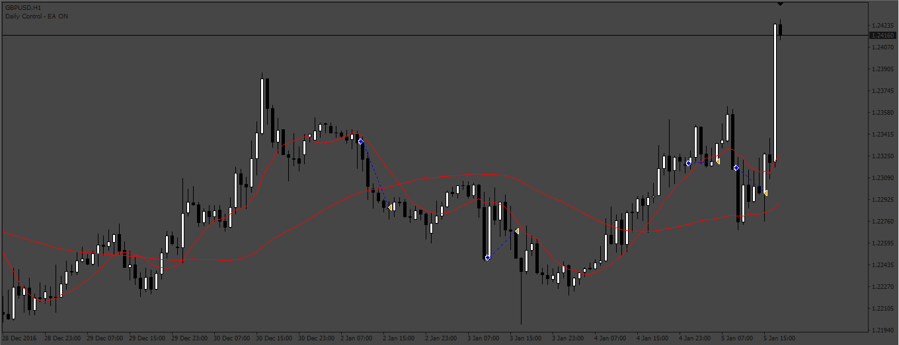
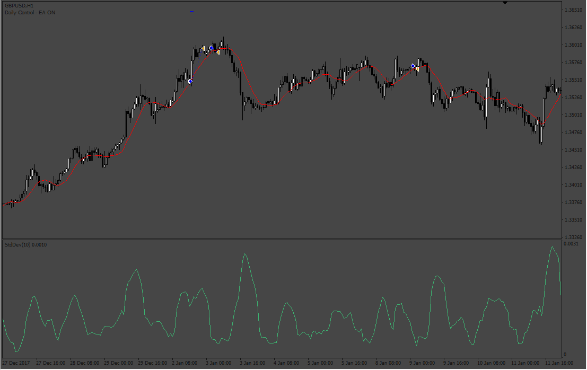
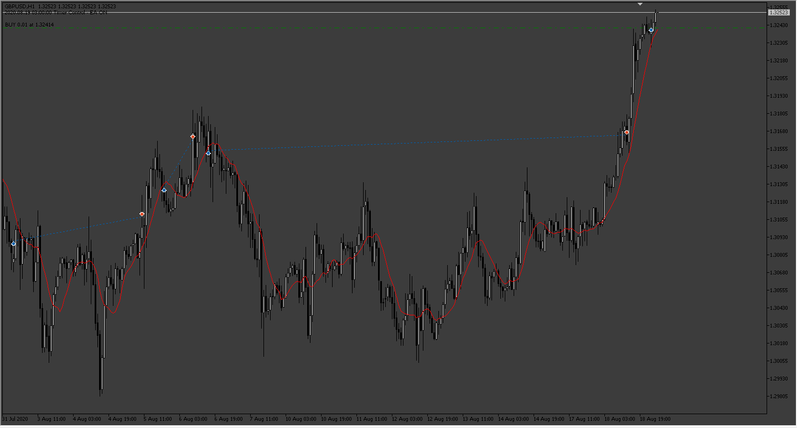
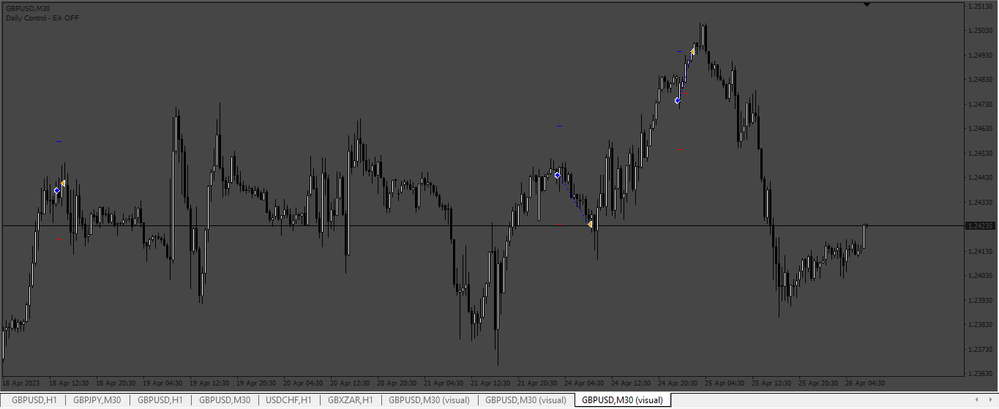
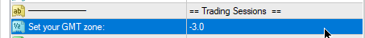

# Tru_EA

> Source: https://fxcodebase.com/code/viewtopic.php?f=38&t=73365  
> Forum: 38 · Topic 73365 · 11 post(s)

---

## Tru_EA

**Apprentice** · Fri Feb 10, 2023 8:29 am

Based on the request.
[https://fxcodebase.com/code/viewtopic.php?f=38&t=73332](https://fxcodebase.com/code/viewtopic.php?f=38&t=73332)

 [Tru_EA.mq4](files/149593/Tru_EA.mq4)

 

 [Tru_EA_v2.mq4](files/149593/Tru_EA_v2.mq4)

 

 [Tru_EA.mq5](files/149593/Tru_EA.mq5)

---

## Re: Tru_EA

**Elielson00x** · Mon Feb 20, 2023 2:26 am

Hello apprentice, hope you are well.

You can edit this EA, setting it only for the Bot to enter after crossing the averages with the closing of the candle, and exit the trade after the averages cross again in the opposite direction, in this case the first trade is closed and a second one is closed. trade is open but in the direction of the new crossover. The rest of the settings can remain the same.
Grateful!

---

## Re: Tru_EA

**Apprentice** · Wed Feb 22, 2023 2:56 am

We have added your request to the development list.
Development reference 158.

---

## Re: Tru_EA

**Elielson00x** · Wed Feb 22, 2023 9:10 am

Apprentice, thanks for your attention, if possible make the change to the MT5 Platform please. Thank you friend!

---

## Re: Tru_EA

**Apprentice** · Tue Feb 28, 2023 4:36 am

We have added your request to the development list.
Development reference 198.

---

## Re: Tru_EA

**Apprentice** · Tue Feb 28, 2023 5:53 am

V2 based on request 158. added.

---

## Re: Tru_EA

**Apprentice** · Tue Jul 04, 2023 10:36 am

MT5 version added.

---

## Re: Tru_EA

**TruCxpt** · Sat Aug 05, 2023 12:48 pm

> **Apprentice wrote:**
> MT5 version added.

For the Tru_V2, I have these simple requests:

-Removal of parameters:
1. Close by Number of candles exit rule.
2. Standard dev exit rule.
3. Trailing stop loss.
4. Setup Lots by Money and Account balance.

-and the fix of these settings
1. On/off daily control function to accurately run in line with scheduled Days of week and Time. Aka actually turning on/off when it's meant to.
2. Making sure that Breakeven pending orders always execute (invalid pointer access in "" (2829,33) fix that please.

If it’s possible to add a current Detrend “Value” in the chart, and what the Detrend value of the selected period is, that would also be great. This is to visualise and see the current market condition and how far the current price has detrended against the calculated “N period” - Note close of bar to enter is still applied.

Simple EA placing order when detrend value condition is met.
Uses a time schedule, turns off/on when local time permits.
Breakeven Sl is always ready.

Thanks

---

## Re: Tru_EA

**Apprentice** · Tue Aug 08, 2023 3:12 am

We have added your request to the development list.
Development reference 674.

---

## Re: Tru_EA

**Apprentice** · Thu Aug 10, 2023 12:28 pm

 

 [Tru_EA_v3.mq4](files/152008/Tru_EA_v3.mq4)

---

## Re: Tru_EA

**TruCxpt** · Fri Aug 18, 2023 6:26 pm

> **Apprentice wrote:**
>
>
> 674.png
>
>
>
>
> SetGMTtimeZone.png
>
>
>
>
> Tru_EA_v3.mq4

It barely enters any trades as it did before. I don't really understand how this EA needs 4000 lines of code just to enter with a detrend formula, TP/SL/BE and Time schedule/notification

All I ask is to add a "monitor" for the V2 EA showing the current close bar detrend value and the detrend length period value.(Because its using a lookback period to compare the current price hence "Detrend"). So its possible to see how far exactly price needs to move in order to enter. Otherwise there's nothing to really reference off or monitor when the EA will enter a trade.
