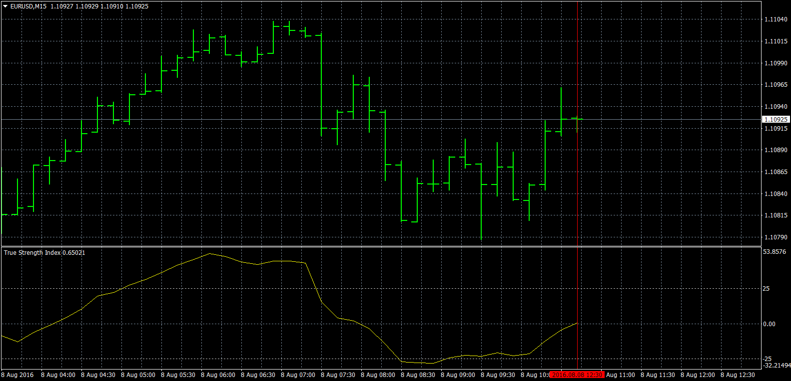
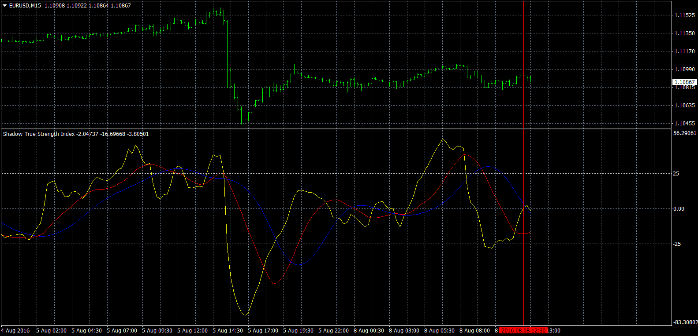

# True Strength Index

> Source: https://fxcodebase.com/code/viewtopic.php?f=38&t=63740  
> Forum: 38 · Topic 63740 · 1 post(s)

---

## True Strength Index

**Apprentice** · Mon Aug 08, 2016 5:56 am

 [True Strength Index.mq4](files/107517/True%20Strength%20Index.mq4)

 

 [Shadow True Strength Index.mq4](files/107517/Shadow%20True%20Strength%20Index.mq4)

TS2/Marketscope Version is available here.
[viewtopic.php?f=17&t=63466&p=106431&hilit=Shadow+TSI#p106431](https://fxcodebase.com/code/viewtopic.php?f=17&t=63466&p=106431&hilit=Shadow+TSI#p106431)
