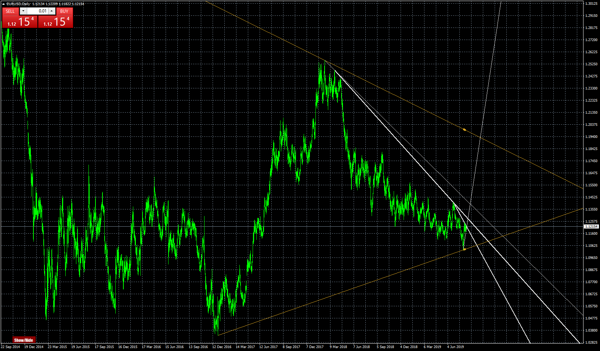
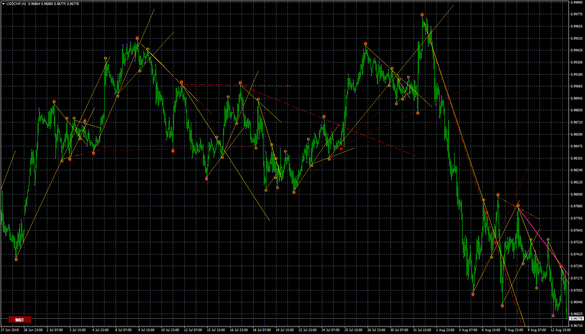

# TrueTL

> Source: https://fxcodebase.com/code/viewtopic.php?f=38&t=68781  
> Forum: 38 · Topic 68781 · 12 post(s)

---

## TrueTL

**Apprentice** · Tue Aug 13, 2019 7:47 am

Based on request.
[viewtopic.php?f=27&t=68766](https://fxcodebase.com/code/viewtopic.php?f=27&t=68766)

 [TrueTL.mq4](files/127872/TrueTL.mq4)

---

## WATL-Open Source

**Apprentice** · Tue Aug 13, 2019 7:50 am

 [WATL-Open Source.mq4](files/127875/WATL-Open%20Source.mq4)

---

## Re: TrueTL

**TheGMan** · Tue Aug 13, 2019 6:00 pm

Thank you very much, Apprentice & team! Great job on both!

G

---

## Re: TrueTL

**SANTOSH** · Mon Sep 09, 2019 9:42 am

> **Apprentice wrote:**
>
>
> eurusd-d1-forex-capital-markets-2.png
>
>
> Based on request.
> [viewtopic.php?f=27&t=68766](https://fxcodebase.com/code/viewtopic.php?f=27&t=68766)
>
>
> TrueTL.mq4

Can it be written in lua ?
Will be a great help .

Regards,
SANTOSH

---

## Re: TrueTL

**Apprentice** · Tue Sep 10, 2019 8:00 am

Your request is added to the development list.
Development reference 59.

---

## Re: TrueTL

**Apprentice** · Thu Sep 12, 2019 6:45 am

[TrueTL.lua](files/128597/TrueTL.lua)

I have got something completely different. I didn't manage to convert
it exactly like MT4 version. I decided to stop for now, since it takes
A LOT of time.

---

## Re: TrueTL

**mahday12** · Sat Jul 13, 2024 12:23 am

Hi Apprentice

Colud you or any one of coders... make this indicator (truetl.mq4) be convert to MT5 format?

Thank you for your kind and big appreciate for your work

---

## Re: WATL-Open Source

**khanatd** · Wed Oct 01, 2025 10:57 pm

plz make arrows at points of reversals at close of current candles too nRP, THANKS

---

## Re: TrueTL

**Apprentice** · Sat Oct 04, 2025 2:50 pm

We have added your request to the development list.
Development reference 635

---

## Re: TrueTL

**khanatd** · Wed Oct 29, 2025 12:23 am

hi sir any update which date i can get it
?

thanks
khan

---

## Re: TrueTL

**opticore** · Fri Oct 31, 2025 5:06 am

Can you make it in mql5?

---

## Re: TrueTL

**Apprentice** · Sun Nov 09, 2025 8:33 am

We have added your request to the development list.
Development reference 722
