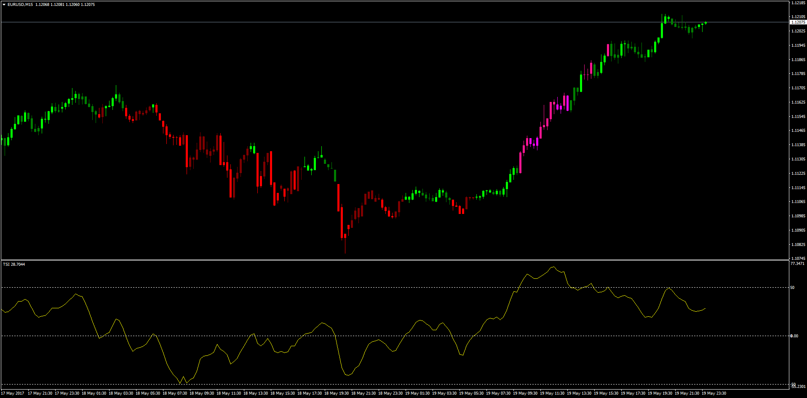
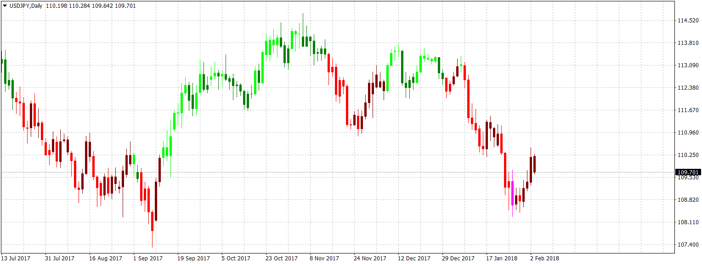

# TSI Overlay

> Source: https://fxcodebase.com/code/viewtopic.php?f=38&t=64665  
> Forum: 38 · Topic 64665 · 8 post(s)

---

## TSI Overlay

**Apprentice** · Sun May 21, 2017 6:10 am

LUA Original: [viewtopic.php?f=17&t=34868](https://fxcodebase.com/code/viewtopic.php?f=17&t=34868)

Description:

Included is also the TSI.mq4 indicator which is not included in the MT4 indicators. Please attach it to the same folder you will be using the TSI Overlay indicator.

How the candles are colored (default colors):

Lime: Above Zero Positive Slope
Green: Above Zero Negative Slope
Red: Below Zero Negative Slope
Maroon: Below Zero Positive Slope
Deep Pink: Above OB or Below OS with Positive Slope
Magenta: Above OP or Below OS with Negative Slope

 [TSI.mq4](files/112478/TSI.mq4)

 [TSI_Overlay.mq4](files/112478/TSI_Overlay.mq4)

 [TSI_Overlay with Alert.mq4](files/112478/TSI_Overlay%20with%20Alert.mq4)

---

## Re: TSI Overlay

**Apprentice** · Fri Jan 26, 2018 9:32 am

Minor update.

---

## Re: TSI Overlay

**bartwas1** · Fri Feb 02, 2018 9:41 am

hi Apprentice

I wanted to test TSI overlay, but I don't see any overlay. I've got several TSI's versions in my indicator folder and yours as well. I've checked TSI Overlay code and compiled again - didn't change anything, but it shows an error/warning 'not all control paths return a value'.
On my chart I'm using TSI and TSI overlay - no change. When I hover with a mouse above the candle it says that TSI overlay is applied, but the candle doesn't change colour. I've changed the thickness of the overlay to 8 when compiling your code, but as result I got slightly thicker candles with some barely visible contours of the overlay colours, but not the same as in your post.
Any chances for some assistance?

Kind regards
Bart

---

## Re: TSI Overlay

**Apprentice** · Mon Feb 05, 2018 5:02 pm

Please install both indicators.
TSI & TSI Overlay

---

## Re: TSI Overlay

**bartwas1** · Fri Feb 09, 2018 5:26 am

Hi

Thanks for you assistance. I think TSI overlay was in conflict with another indicator I'd had on my chart. It works as you've described when I created a separate chart.

---

## Re: TSI Overlay

**isamegrelo** · Tue Aug 14, 2018 5:46 pm

please add alert when TSI overlay change color.

---

## Re: TSI Overlay

**Apprentice** · Wed Aug 15, 2018 5:24 am

Your request is added to the development list under Id Number 4226

---

## Re: TSI Overlay

**Apprentice** · Sat Aug 18, 2018 5:52 am

TSI_Overlay with Alert added.
