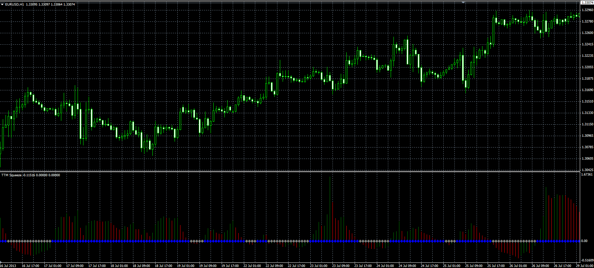

# TTM Squeeze

> Source: https://fxcodebase.com/code/viewtopic.php?f=38&t=59084  
> Forum: 38 · Topic 59084 · 1 post(s)

---

## TTM Squeeze

**Alexander.Gettinger** · Tue Aug 13, 2013 2:03 pm

Original LUA indicator: [viewtopic.php?f=17&t=42679](https://fxcodebase.com/code/viewtopic.php?f=17&t=42679).

Formulas:
TTMS = (H-L)/(TL-BL)-1, where
H = MA(Keltner_Length, Keltner_Smooth_Method, Close)+ATR(Keltner_Smooth_Length)*Keltner_Deviation,
L = MA(Keltner_Length, Keltner_Smooth_Method, Close)-ATR(Keltner_Smooth_Length)*Keltner_Deviation,
TL = ML+BB_Deviation*D,
BL = ML-BB_Deviation*D,
ML = SMA(BB_Length, Close),
D = StdDev(BB_Length, Close).

 

Download:

 [TTMS.mq4](files/88510/TTMS.mq4)

 [TTMS_with_Alert.mq4](files/88510/TTMS_with_Alert.mq4)
