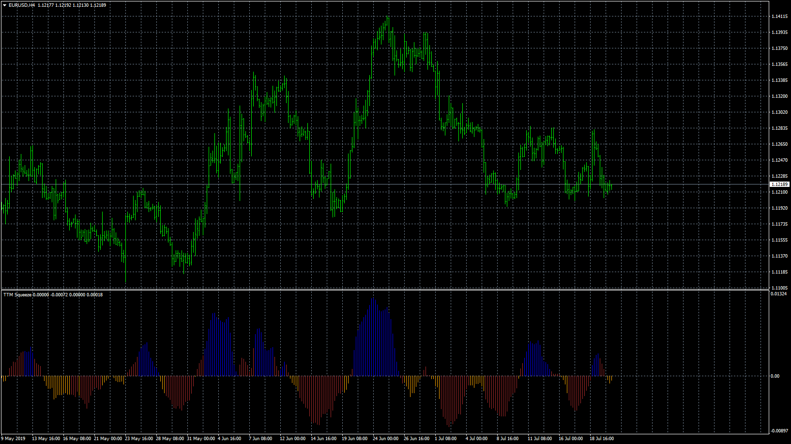
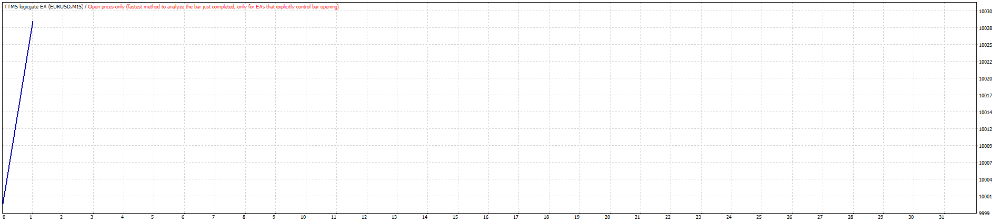
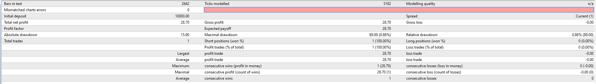
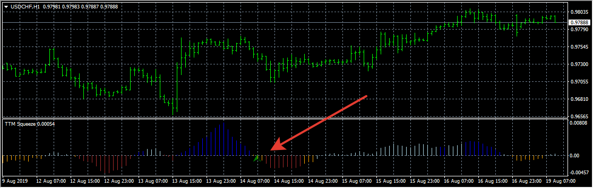
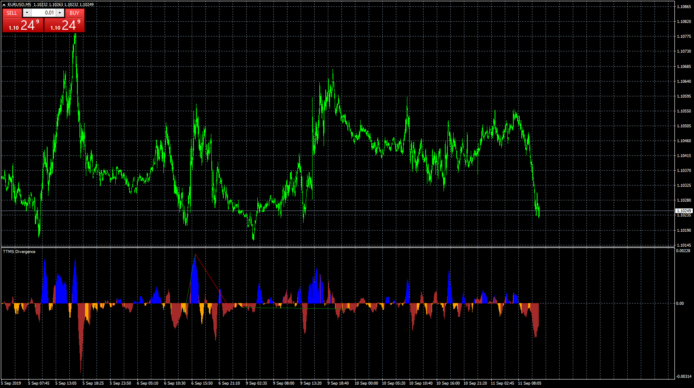

# TTMS (logicgate)

> Source: https://fxcodebase.com/code/viewtopic.php?f=38&t=68690  
> Forum: 38 · Topic 68690 · 22 post(s)

---

## TTMS (logicgate)

**Apprentice** · Mon Jul 22, 2019 6:48 am

Based on request.
[viewtopic.php?f=27&t=68672](https://fxcodebase.com/code/viewtopic.php?f=27&t=68672)

 [TTMS.logicgate.mq4](files/127461/TTMS.logicgate.mq4)

 

 

 [TTMS logicgate EA.mq4](files/127461/TTMS%20logicgate%20EA.mq4)

---

## Re: TTMS (logicgate)

**logicgate** · Mon Jul 22, 2019 9:13 am

Thanks buddy. but some stuff needs to be corrected:

The histogram going up in red should be lighter blue.

It is missing the dots the signal the squeeze:

the red dots when the squeeze is happening, and the green dots when you are supposed to buy or sell/

Can you add that my friend? Are those missing from the code posted?

---

## Re: TTMS (logicgate)

**maclaud** · Tue Jul 23, 2019 2:54 pm

maybe this can help?:)

---

## Re: TTMS (logicgate)

**logicgate** · Wed Jul 24, 2019 8:40 am

Thanks mate.

But I wanted our friend Apprentice to correct the indicator posted here.

---

## Re: TTMS (logicgate)

**Apprentice** · Fri Jul 26, 2019 4:04 am

Try this version.

 [TTMS.logicgate.mq4](files/127571/TTMS.logicgate.mq4)

---

## Re: TTMS (logicgate)

**logicgate** · Fri Jul 26, 2019 8:53 am

Thanks mate, gonna check it out.

---

## Re: TTMS (logicgate)

**logicgate** · Sat Aug 17, 2019 8:29 am

Almost there my friend, it is still missing the dots at the zero line that signals that the squeeze is happening (the red dots), and the green dots that signal to take action, like in the indicator images I have posted here:

[http://www.fxcodebase.com/code/viewtopi ... 27&t=68672](http://www.fxcodebase.com/code/viewtopic.php?f=27&t=68672)

---

## Re: TTMS (logicgate)

**Apprentice** · Mon Aug 19, 2019 6:28 am

I don't have any issues.

---

## Re: TTMS (logicgate)

**logicgate** · Mon Aug 19, 2019 7:16 pm

No my friend, I am not talking about that. I am talking about the dots, like in this image I have attached. The indi you coded does not warn us when the squeeze starts, this is important because it grabs your attention and you know that the signal might be coming soon when the "release" happens.

---

## Re: TTMS (logicgate)

**Apprentice** · Fri Aug 23, 2019 5:43 am

[TTMS.logicgate.mq4](files/128156/TTMS.logicgate.mq4)

Try this version.

---

## Re: TTMS (logicgate)

**logicgate** · Fri Aug 23, 2019 8:39 am

Thanks !

---

## Re: TTMS (logicgate)

**berkcetiner** · Mon Sep 09, 2019 12:35 pm

Hello for everybody, i need this indicator with divergence finder and e-mail alert. Is there anybody to help me in this case?

Thanks a lot for the great work.

---

## Re: TTMS (logicgate)

**Apprentice** · Tue Sep 10, 2019 7:58 am

Your request is added to the development list.
Development reference 58.

---

## Re: TTMS (logicgate)

**Apprentice** · Wed Sep 11, 2019 6:07 am

 [TTMS divergence.mq4](files/128574/TTMS%20divergence.mq4)

---

## Re: TTMS (logicgate)

**bartwas1** · Thu Sep 12, 2019 4:24 am

Hi Apprentice

Could this version of TTMS (logicgate) you've made be available in lua? I am referring to the one published in post Fri Aug 23, 2019 10:43 am.
Thanks
Bart

---

## Re: TTMS (logicgate)

**Apprentice** · Thu Sep 12, 2019 8:07 am

Your request is added to the development list.
Development reference 76.

---

## Re: TTMS (logicgate)

**Apprentice** · Fri Sep 13, 2019 6:04 am

TS2/Lua version.
[viewtopic.php?f=17&t=68913](https://fxcodebase.com/code/viewtopic.php?f=17&t=68913)

---

## Re: TTMS (logicgate)

**berkcetiner** · Wed Sep 18, 2019 3:05 pm

> **Apprentice wrote:**
>
>
> eurusd-m5-forex-capital-markets.png
>
>
>
>
> TTMS divergence.mq4

Hello Apprentice,

I have checked the indicator but divergence lines doesn't seem right. Could you check the divergence lines again please, i really need proper divergence detection for this indicator. It will be really helpful in any market.

Thanks a lot mate

---

## Re: TTMS (logicgate)

**Apprentice** · Wed Oct 02, 2019 4:37 am

[TTMS_divergence.mq4](files/128948/TTMS_divergence.mq4)

Try this version.

---

## Re: TTMS (logicgate)

**logicgate** · Sun Jul 24, 2022 6:18 am

> **Apprentice wrote:**
>
>
> TTMS.logicgate.mq4
>
>
> Try this version.

Hello my friend, can we please get a MT5 version of this?

[https://fxcodebase.com/code/viewtopic.p ... 90#p128156](https://fxcodebase.com/code/viewtopic.php?f=38&t=68690#p128156)

---

## Re: TTMS (logicgate)

**Apprentice** · Wed Jul 27, 2022 2:11 am

We have added your request to the development list.
Development reference 449.

---

## Re: TTMS (logicgate)

**Apprentice** · Thu Jan 23, 2025 4:53 pm

 [TTMS_logicgate.mq5](files/157990/TTMS_logicgate.mq5)
