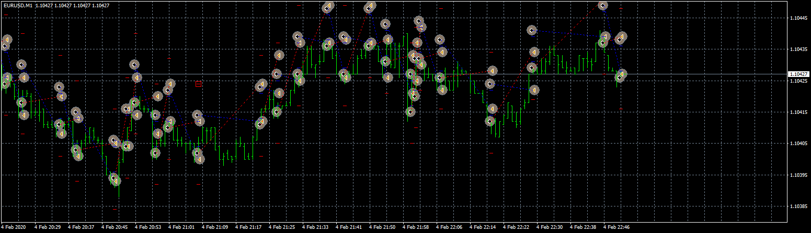

# TupTup_EA

> Source: https://fxcodebase.com/code/viewtopic.php?f=38&t=70507  
> Forum: 38 · Topic 70507 · 5 post(s)

---

## TupTup_EA

**Apprentice** · Mon Oct 05, 2020 9:11 am

Based on request.
[viewtopic.php?f=38&t=70497](https://fxcodebase.com/code/viewtopic.php?f=38&t=70497)

 [TupTup_EA.mq4](files/138064/TupTup_EA.mq4)

---

## Re: TupTup_EA

**taipan** · Tue Oct 06, 2020 12:53 am

> **Apprentice wrote:**
>
>
> eurusd-m1-fxcm-australia-pty.png
>
>
> Based on request.
> [viewtopic.php?f=38&t=70497](https://fxcodebase.com/code/viewtopic.php?f=38&t=70497)
>
>
> TupTup_EA.mq4

Hi Mario,

This ea compiled with 3 errors and 9 warnings, please fix.

---

## Re: TupTup_EA

**Apprentice** · Tue Oct 06, 2020 2:15 am

Your request is added to the development list.
Development reference 2148.

---

## Re: TupTup_EA

**ElectricSavant** · Fri Oct 23, 2020 12:41 pm

Has this EA been fixed?

---

## Re: TupTup_EA

**Apprentice** · Mon Oct 26, 2020 4:53 am

Try it now.
