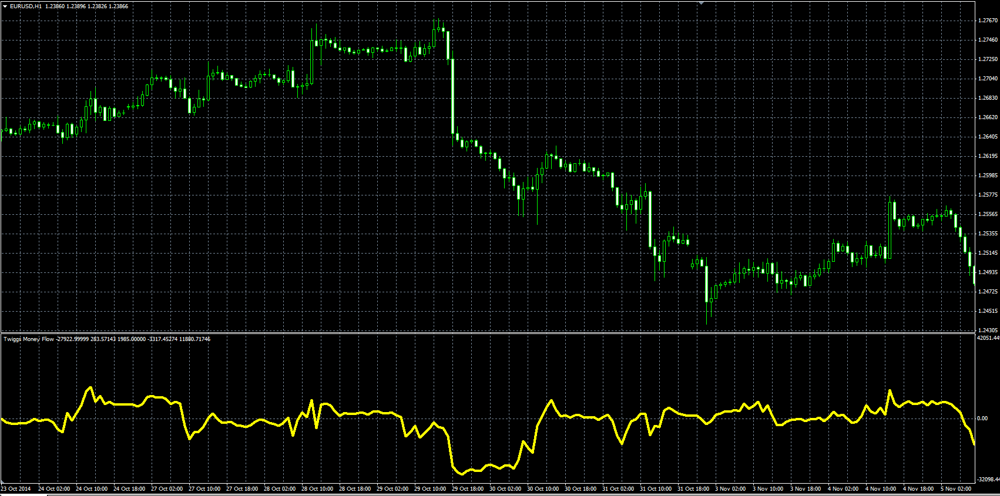

# Twiggs Money Flow

> Source: https://fxcodebase.com/code/viewtopic.php?f=38&t=61517  
> Forum: 38 · Topic 61517 · 8 post(s)

---

## Twiggs Money Flow

**Alexander.Gettinger** · Fri Nov 21, 2014 5:02 pm

Original LUA oscillator: [viewtopic.php?f=17&t=4782](https://fxcodebase.com/code/viewtopic.php?f=17&t=4782).

Formulas:
TMF = WMA(ADV)/WMA(Volume), where
WMA - Wilder's moving average,
ADV = Volume*(2*Close-TRL-TRH)/TR,
TRH[i] = Max(High[i], Close[i-1]),
TRL[i] = Min(Low[i], Close[i-1]),
TR = TRH-TRL.

 

Download:

 [Twiggs_Money_Flow.mq4](files/97288/Twiggs_Money_Flow.mq4)

---

## Re: Twiggs Money Flow

**logicgate** · Tue Jan 01, 2019 8:37 am

Hello brothers! Hope you all are having a great new year, may this new year be of very profitable trading!

I have a request to upgrade this indi, if possible please:

-When above 0 the main data line is green
-When below 0 the main data is red
-Option in indi settings to apply smoothing to main data (SMA or EMA).
-Option in indi settings to apply an SMA or EMA to main data, to serve as a trigger line.

Cheers!

---

## Re: Twiggs Money Flow

**Apprentice** · Wed Jan 02, 2019 5:58 am

Your request is added to the development list under Id Number 4391

---

## Re: Twiggs Money Flow

**Apprentice** · Sat Jan 05, 2019 5:01 am

Try this version.

 [Smoothed_Twiggs_Money_Flow.mq4](files/123203/Smoothed_Twiggs_Money_Flow.mq4)

---

## Re: Twiggs Money Flow

**logicgate** · Sat Jan 05, 2019 6:27 am

> **Apprentice wrote:**
> Try this version.
>
>
> Smoothed_Twiggs_Money_Flow.mq4

Thanks brother!

---

## Re: Twiggs Money Flow

**PURABI** · Fri Jul 17, 2020 12:27 pm

Please Add Multi-symbol option in SmoothedTwiggs money flow indicator.
Thanks in advance.

---

## Re: Twiggs Money Flow

**Apprentice** · Sun Jul 19, 2020 5:15 pm

Your request is added to the development list.
Development reference 1727.

---

## Re: Twiggs Money Flow

**Apprentice** · Tue Jul 21, 2020 8:27 am

[Smoothed_Twiggs_Money_Flow MS MTF.mq4](files/136156/Smoothed_Twiggs_Money_Flow%20MS%20MTF.mq4)

Try this version.
