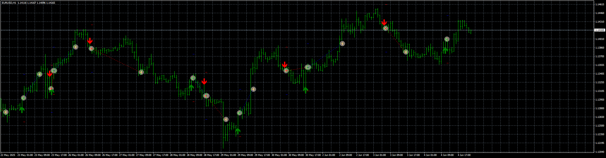

# Twin_Range_Filter_EA

> Source: https://fxcodebase.com/code/viewtopic.php?f=38&t=75990  
> Forum: 38 · Topic 75990 · 1 post(s)

---

## Twin_Range_Filter_EA

**Apprentice** · Wed Jun 04, 2025 3:26 pm

Based on the request.
[https://fxcodebase.com/code/viewtopic.p ... 43#p157143](https://fxcodebase.com/code/viewtopic.php?f=27&t=73739&p=157143#p157143)

 [Twin_Range_Filter_v2.mq5](files/159449/Twin_Range_Filter_v2.mq5)

 [Twin_Range_Filter_EA_v1.00.mq5](files/159449/Twin_Range_Filter_EA_v1.00.mq5)

 [Twin_Range_Filter_v2.mq4](files/159449/Twin_Range_Filter_v2.mq4)

 [Twin_Range_Filter_EA_v1.00.mq4](files/159449/Twin_Range_Filter_EA_v1.00.mq4)
