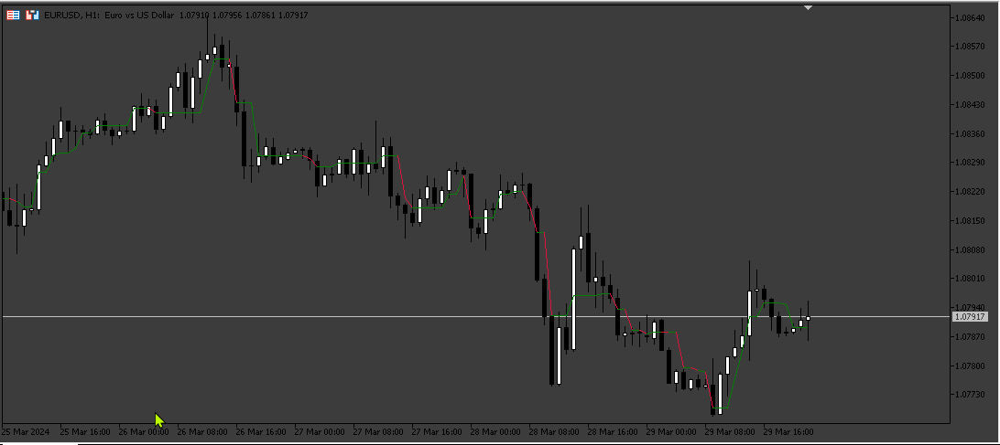
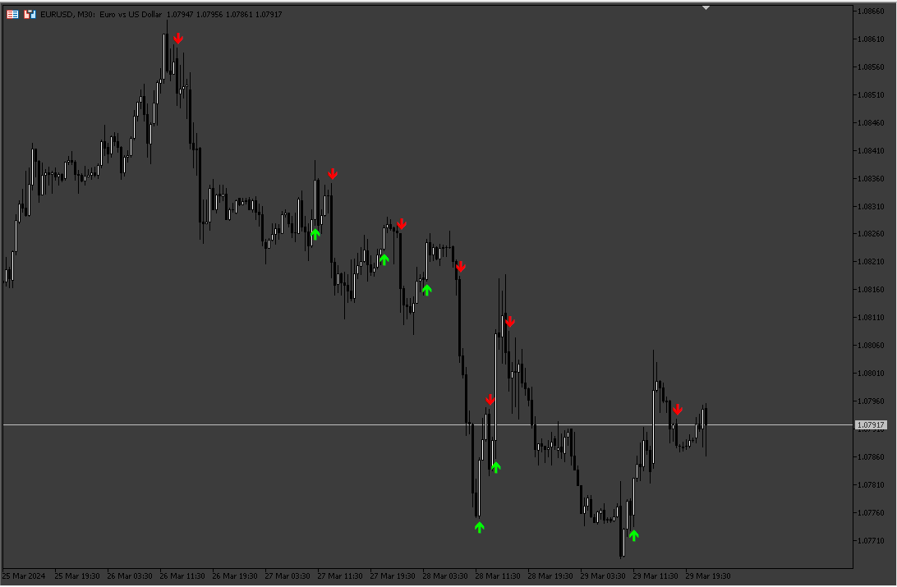

# Twin_Range_Filter_MT5

> Source: https://fxcodebase.com/code/viewtopic.php?f=38&t=74747  
> Forum: 38 · Topic 74747 · 8 post(s)

---

## Twin_Range_Filter_MT5

**Apprentice** · Sat Mar 30, 2024 5:01 pm

Based on the TS2 version.
[https://fxcodebase.com/code/viewtopic.php?f=17&p=154785](https://fxcodebase.com/code/viewtopic.php?f=17&p=154785)

 [Twin_Range_Filter_MT5.mq5](files/154885/Twin_Range_Filter_MT5.mq5)

---

## Re: Twin_Range_Filter_MT5

**Apprentice** · Sat Mar 30, 2024 5:08 pm

Based on the request.
[https://fxcodebase.com/code/viewtopic.php?f=27&t=74738](https://fxcodebase.com/code/viewtopic.php?f=27&t=74738)

 [Twin_Range_Filter_mod_Alert.mq5](files/154887/Twin_Range_Filter_mod_Alert.mq5)

---

## Re: Twin_Range_Filter_MT5

**robins** · Sun Mar 31, 2024 4:43 am

Hello

I have a bug with the Twin Range Filter Mod Alert, the are a lot of red arrows in the bottom of the chart

[https://app.screencast.com/40raJOnIZKmL0](https://app.screencast.com/40raJOnIZKmL0)

And If I add the previous indicator the Twin Range Filter MT5 with line that you send me, it is not the same, with the same internal parameters

Could you help me please to correct it ?

---

## Re: Twin_Range_Filter_MT5

**robins** · Sun Mar 31, 2024 4:46 am

You forgot to put alert too for the Twin Range Filter Mod Alert indicator

---

## Re: Twin_Range_Filter_MT5

**robins** · Mon Apr 01, 2024 4:56 am

Hi

---

## Re: Twin_Range_Filter_MT5

**robins** · Fri Apr 05, 2024 1:21 am

Hello
there is a small problem in it with arrows
[https://app.screencast.com/BgbLvglywkPtp](https://app.screencast.com/BgbLvglywkPtp)
Is it possible to add alert too please ?

---

## Re: Twin_Range_Filter_MT5

**Apprentice** · Fri Apr 05, 2024 5:43 pm

We have added your request to the development list.
Development reference 280

---

## Re: Twin_Range_Filter_MT5

**Apprentice** · Wed May 22, 2024 2:38 pm

Try this version.

 [Twin_Range_Filter_mod_Alert_v2.mq5](files/155455/Twin_Range_Filter_mod_Alert_v2.mq5)
