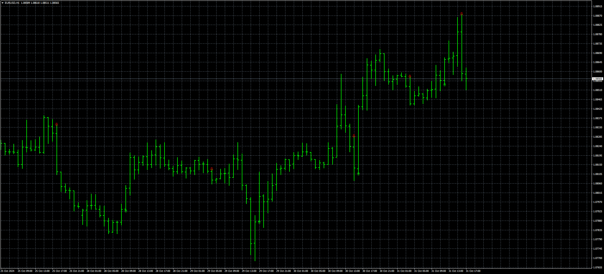

# Twin Range Filter

> Source: https://fxcodebase.com/code/viewtopic.php?f=38&t=75329  
> Forum: 38 · Topic 75329 · 4 post(s)

---

## Twin Range Filter

**Apprentice** · Thu Oct 31, 2024 9:14 am

Based on the source
[https://www.tradingview.com/script/r2aZ ... ge-Filter/](https://www.tradingview.com/script/r2aZvj57-Twin-Range-Filter/)

 [Twin Range Filter.mq4](files/157142/Twin%20Range%20Filter.mq4)

---

## Re: Twin Range Filter

**jollyjegan** · Sat Nov 02, 2024 11:12 am

> **Apprentice wrote:**
>
>
> The attachment **eurusd-h1-stratos-trading-pty.png** is no longer available
>
>
> Based on the source
> [https://www.tradingview.com/script/r2aZ ... ge-Filter/](https://www.tradingview.com/script/r2aZvj57-Twin-Range-Filter/)
>
>
> The attachment **eurusd-h1-stratos-trading-pty.png** is no longer available

Good Effort to convert from pine-script .. great job..

have some BUGS in this indicator..

* kindly check below screenshot, multiple alert message buy& sell in one second. kindly correct when the signal came then only alert message & push notifications will be sent.
* The format of alert message is like Buy or Sell with script name with "signal candle close price" with time.
 Example : " BUY XAUUSD 2750.00 @ 01.11.2024 21:00:00 "

 same format for alert message, push notifications & email also

 

*MULTIPLE ALERTS IN ONE SECOND*

* The second bug is the arrow buy or sell arrow will appear in first candle , second and after some
 candles away. kindly correct, if the arrow appears buy or sell . Don't repaint again. only opposite
 arrow only come after that. kindly make this indicator as "NON-REPAINT Indicator".

---

## Re: Twin Range Filter

**Apprentice** · Wed Nov 06, 2024 3:05 pm

We have added your request to the development list.
Development reference 843

---

## Re: Twin Range Filter

**Apprentice** · Wed May 07, 2025 11:45 am

[Twin_Range_Filter_v2.mq4](files/159150/Twin_Range_Filter_v2.mq4)

Try this version.
