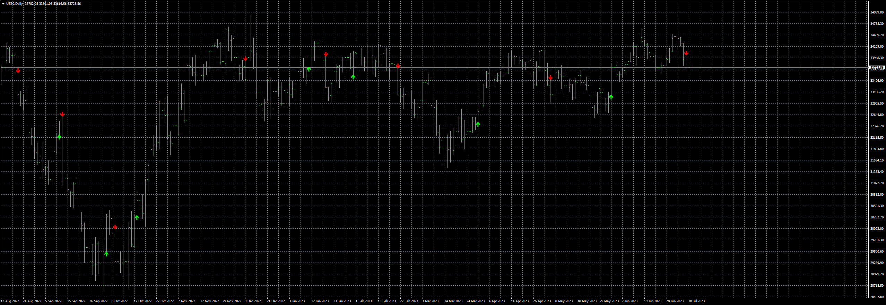
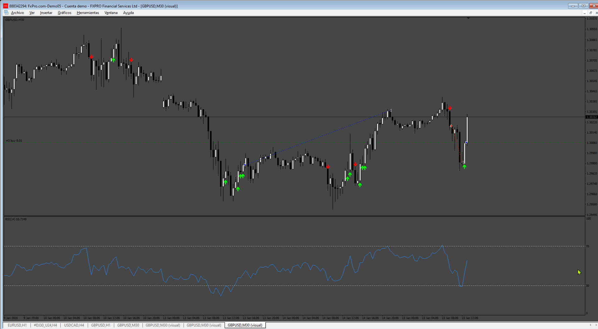

# Twin_Range_Filter

> Source: https://fxcodebase.com/code/viewtopic.php?f=38&t=73911  
> Forum: 38 · Topic 73911 · 12 post(s)

---

## Twin_Range_Filter

**Apprentice** · Mon Jul 10, 2023 3:26 am

Based on the request.
[https://fxcodebase.com/code/viewtopic.php?f=38&t=73284](https://fxcodebase.com/code/viewtopic.php?f=38&t=73284)

 [Twin_Range_Filter.mq4](files/151568/Twin_Range_Filter.mq4)

---

## Re: Twin_Range_Filter

**trtrader** · Mon Jul 22, 2024 10:32 pm

Hi Could you please build this EA?

Close:
- opposite signal

Stop loss:
- Highest or lowest point plus pips

Trailing options:
- start
- distance
- step

Take profit options

- RSI hit 70 or 30 by default.
- Highest or lowest point plus pips
- risk reward

---

## Re: Twin_Range_Filter

**Apprentice** · Thu Jul 25, 2024 4:06 pm

We have added your request to the development list.
Development reference 605

---

## Re: Twin_Range_Filter

**Apprentice** · Tue Jul 30, 2024 4:41 pm

 [Twin_Range_Filter_EA.mq4](files/156278/Twin_Range_Filter_EA.mq4)

---

## Re: Twin_Range_Filter

**trtrader** · Tue Jul 30, 2024 8:36 pm

Could you please add the attached indicator as filter? green only allow buy and red only allow sell.

---

## Re: Twin_Range_Filter

**Apprentice** · Wed Jul 31, 2024 3:22 pm

We have added your request to the development list.
Development reference 618

---

## Re: Twin_Range_Filter

**Apprentice** · Tue Aug 06, 2024 3:11 pm

It is important for the indicator to have exactly this file name as I attached; otherwise, it will continuously send alerts.

 [Twin_Range_Filter_EA_v2.mq4](files/156334/Twin_Range_Filter_EA_v2.mq4)

 [!!supertrend_-_cci_histo_(mtf_+_arrows_+_alerts).ex4](files/156334/supertrend_-_cci_histo_%28mtf__arrows__alerts%29.ex4)

---

## Re: Twin_Range_Filter

**jollyjegan** · Fri Oct 04, 2024 12:16 pm

> **Apprentice wrote:**
>
>
> us30-d1-fxcm-australia-pty.png
>
>
> Based on the request.
> [https://fxcodebase.com/code/viewtopic.php?f=38&t=73284](https://fxcodebase.com/code/viewtopic.php?f=38&t=73284)
>
>
> Twin_Range_Filter.mq4

KINDLY ADD THE FOLLOWING FOR INDICATOR & EA BOTH , (WHEN ARROW APPEARS) WITH BUY/SELL & ENTRY PRICE (WITH TIME FRAME MENTIONED)
1. ADD ALERT ON POPUP MESSAGE.
2. ADD ALERT ON PUSH MESSAGE.
3. ADD EMAIL ALERT.

 FOR BOTH MT4 & MT5 VERSIONS.

THANKS IN ADVANCE.

---

## Re: Twin_Range_Filter

**Apprentice** · Sun Oct 06, 2024 3:46 am

We have added your request to the development list.
Development reference 763

---

## Re: Twin_Range_Filter

**trtrader** · Mon Dec 23, 2024 9:17 pm

Could you please add EMA filter?

- when EMA 50 above EMA 100, allow only buy.
- when EMA 50 below EMA 100, allow only sell.

---

## Re: Twin_Range_Filter

**Apprentice** · Mon Dec 30, 2024 7:53 pm

We have added your request to the development list.
Development reference 936

---

## Re: Twin_Range_Filter

**Apprentice** · Wed Feb 19, 2025 6:54 am

[Twin_Range_Filter_EA_v3.mq4](files/158312/Twin_Range_Filter_EA_v3.mq4)

Filter added.
