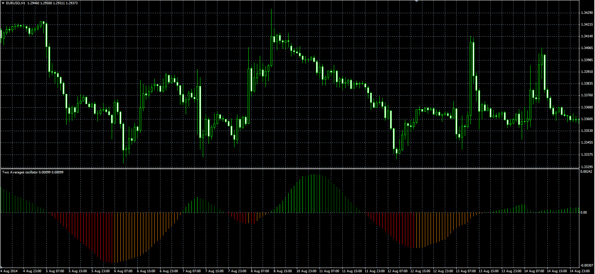

# Two Averages Oscillator

> Source: https://fxcodebase.com/code/viewtopic.php?f=38&t=61150  
> Forum: 38 · Topic 61150 · 1 post(s)

---

## Two Averages Oscillator

**Alexander.Gettinger** · Mon Sep 15, 2014 12:13 pm

Original LUA oscillator: [viewtopic.php?f=17&t=13963](https://fxcodebase.com/code/viewtopic.php?f=17&t=13963).

> This simple indicator is the result of the difference between two moving averages.

 

Download:

 [Two_Averages_Oscillator.mq4](files/95897/Two_Averages_Oscillator.mq4)
