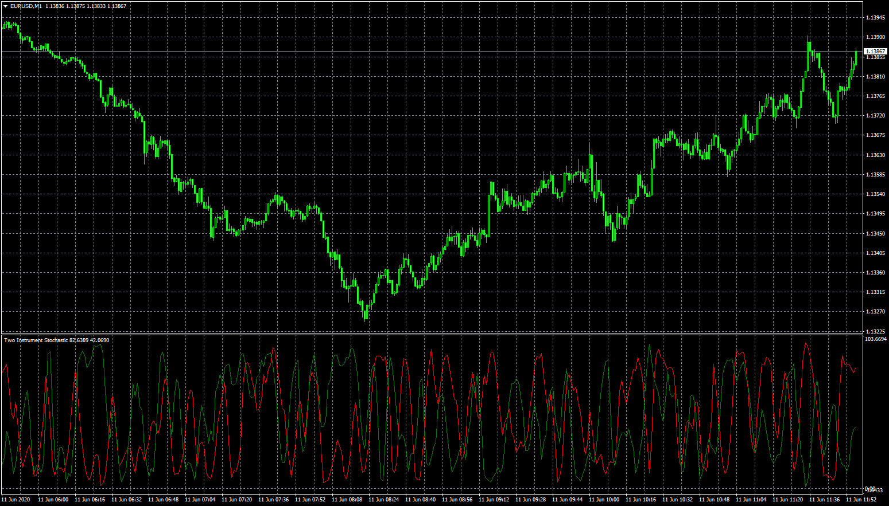

# Two Instrument Stochastic

> Source: https://fxcodebase.com/code/viewtopic.php?f=38&t=69998  
> Forum: 38 · Topic 69998 · 1 post(s)

---

## Two Instrument Stochastic

**Apprentice** · Thu Jun 11, 2020 5:46 am

Based on TS2/Lua version
[viewtopic.php?f=17&t=4906](https://fxcodebase.com/code/viewtopic.php?f=17&t=4906)

 [Two Instrument Stochastic.mq4](files/134822/Two%20Instrument%20Stochastic.mq4)
